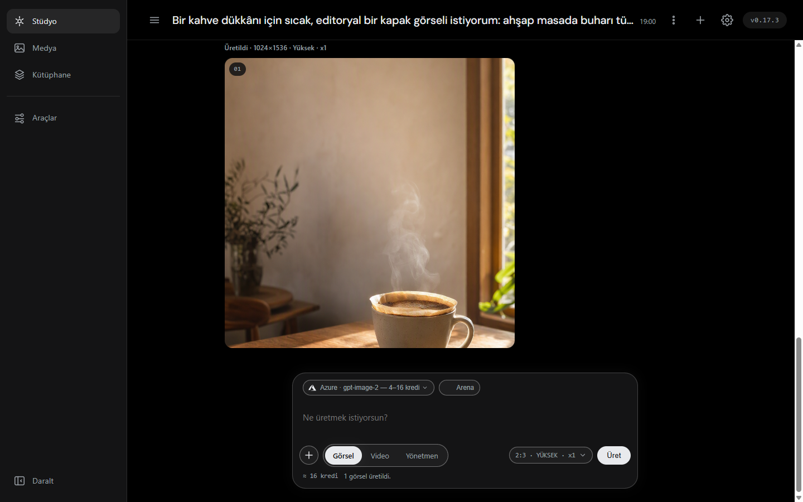
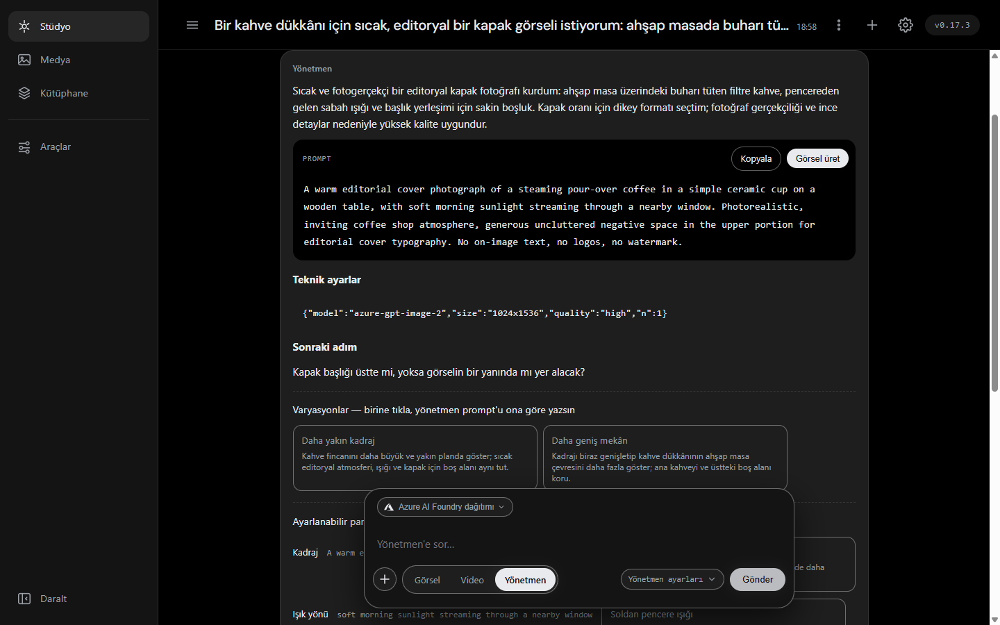
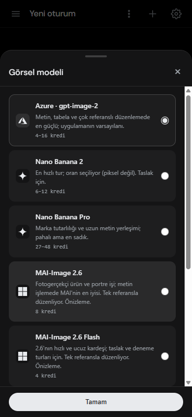
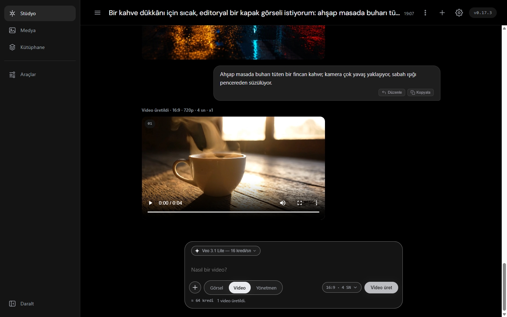
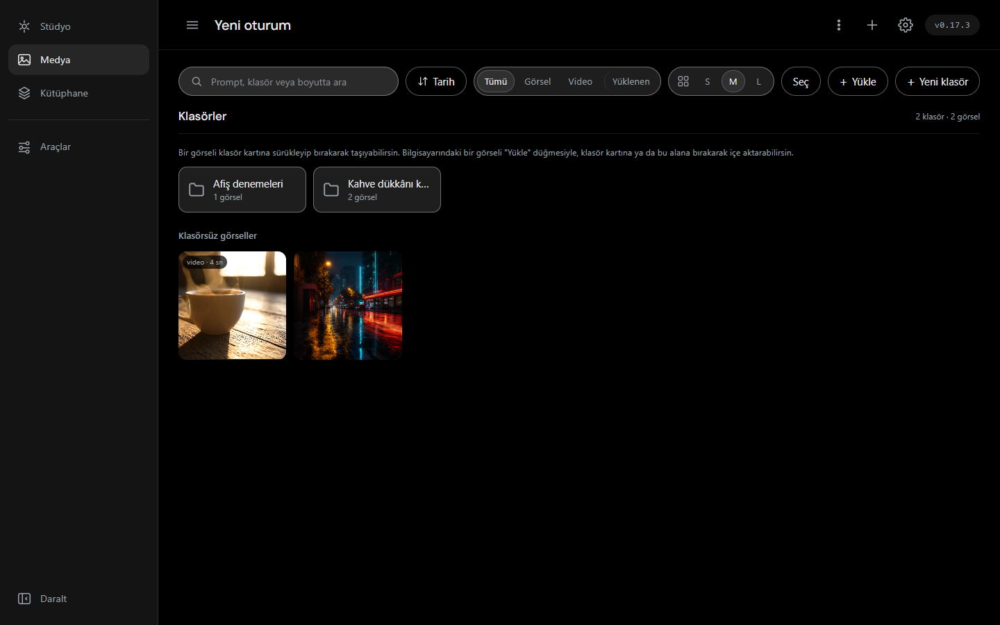
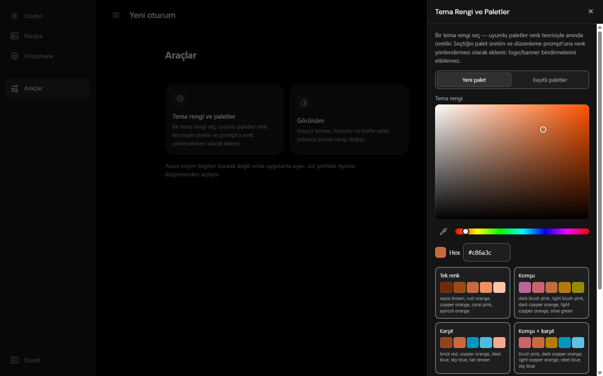
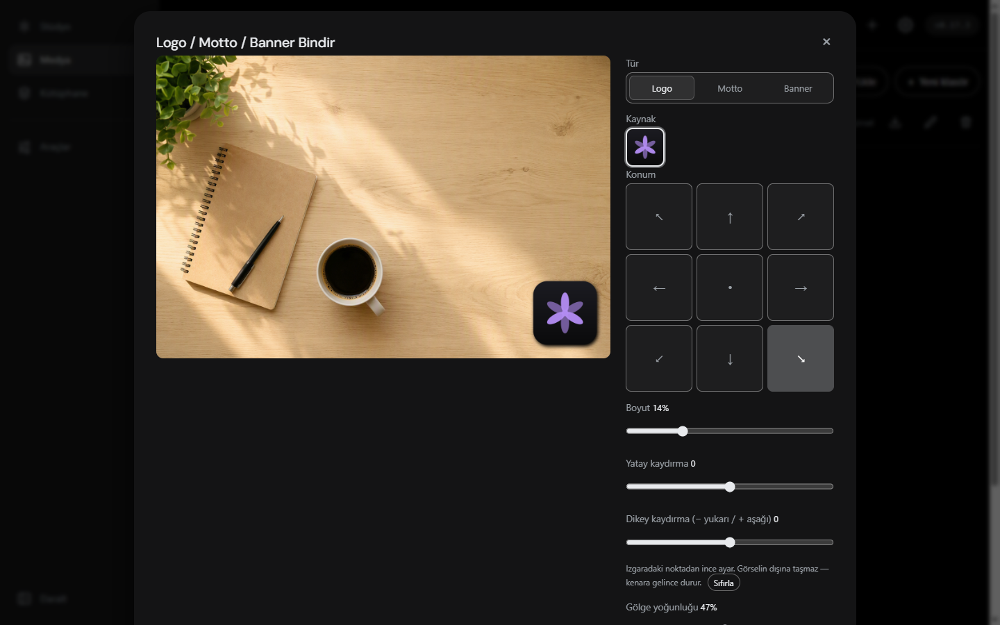
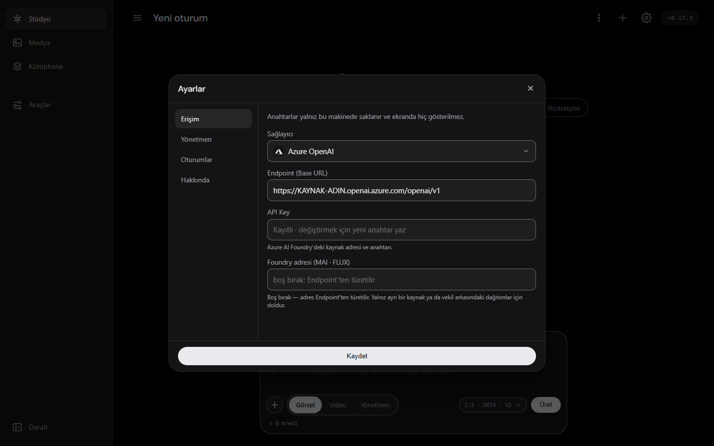

# Kromis Studio

[](https://github.com/Zenginby/kromis/releases/latest)
[](LICENSE)
[](https://www.python.org/)
[](https://github.com/Zenginby/kromis/actions)

**Kendi dilinde anlat, prompt'u uygulama yazsın.** Kromis Studio; görsel ve video
üretimini, görsel düzenlemeyi, renk paletini ve kurumsal logo/motto/banner
bindirmeyi tek pencerede toplar. Masaüstü uygulaması olarak da, bilgisayarındaki
yerel bir web sayfası olarak da aynı şeydir.

Anahtarlar senin (BYOK), üretilen her şey senin diskinde durur — arada bir
sunucu yok.

🇬🇧 [English](README.en.md) · 📦 [Kurulum](KURULUM.md) · 📖 [Tüm özellikler](docs/ozellikler.md)



---

## 🚀 İndir

| Platform | Mimari | İndirme |
|---|---|---|
| 🍏 **macOS** | Apple Silicon (M1–M4) | [ZIP / ARM64](https://github.com/Zenginby/kromis/releases/latest/download/kromis-macOS-arm64.zip) |
| 🪟 **Windows** | x64 (Windows 10 / 11) | [ZIP / x64](https://github.com/Zenginby/kromis/releases/latest/download/kromis-windows-x64.zip) |
| 🤖 **Android** | arm64-v8a (Android 8.0+) | [APK / arm64](https://github.com/Zenginby/kromis/releases/latest/download/kromis-android-arm64.apk) |

Bağlantılar her zaman **en son yayına** gider; sürüm yükselince adres değişmez.

> [!TIP]
> Android sürümü Play Store'da değil, APK doğrudan kurulur — ve telefonda TAM
> çalışır: üretim, düzenleme, palet ve bindirme cihazdaki Python çalışma
> zamanında koşuyor. Güncellerken **uygulamayı silme, üzerine kur**; paketler
> aynı anahtarla imzalandığı için verin yerinde kalır.
>
> macOS Gatekeeper, Windows SmartScreen ve Android "bilinmeyen kaynak"
> adımlarının tamamı: [KURULUM.md](KURULUM.md).

---

## ✨ Güncel Özellikler (v0.21.0)

### Fikri kendi dilinde anlat, prompt'u Yönetmen yazsın

Ne istediğini gündelik dille yaz — **hangi dilde yazarsan o dilde cevap
alırsın**; sınır Yönetmen olarak seçtiğin sohbet modelinin desteklediği
dillerdir. Yönetmen bunu optimize edilmiş **İngilizce** bir prompt'a ve teknik
ayarlara (boyut, kalite, adet) çevirir; kararsız kaldığı yeri sana
**tıklanabilir seçeneklerle** sorar, varyasyon ve parametre ekseni önerir.
Beğendiğin prompt tek tuşla üretime gider.

Prompt'un İngilizce olması bir dil tercihi değil ölçülmüş bir davranış: aynı
sahne İngilizce tarif edildiğinde görsel modelleri belirgin biçimde daha sadık
çıktı veriyor. Türkçe (ya da başka bir dilde) prompt istersen Yönetmen onu da
verir, İngilizcesini yanına ekler.

### Arayüz dili: Türkçe ya da İngilizce

Ayarlar → **Dil / Language**. Seçim `prefs.json`'a yazılıyor, yani uygulamayı
kapatıp açınca yerinde duruyor. Arayüzün tamamı — menüler, durum satırları,
onay pencereleri ve hata mesajları — seçilen dilde geliyor. Belgeler ve
buradaki ekran görüntüleri Türkçe kalıyor.



### Üret ve düzenle — birçok model, tek şerit

Azure OpenAI (`gpt-image-2`), Google Gemini (Nano Banana 2 / Pro), Azure AI
Foundry (MAI-Image, FLUX.2) ve OpenAI aynı şeritten seçilir. Her model kartı ne
işe yaradığını bir satırda söyler ve kredi aralığını gösterir; şerit yalnız
**anahtarı kayıtlı** sağlayıcıları listeler. Düzenleme (inpainting) modunda ana
referansın yanına 3 ek referans görsel konabilir.



### Metinden video, tek tıkla canlandırma

Composer'ın üçüncü modu video: Gemini · Veo 3.1'in üç kademesi (Lite / Fast /
tam), 4–6–8 saniye, 16:9 veya 9:16. Anahtar görsel tarafıyla paylaşılır, yeni
bir ayar alanı yok. Galerideki bir görseli ilk kare yapıp canlandırabilirsin;
kayıt türev bağını korur.



> [!WARNING]
> Video üretimi **1–6 dakika sürer ve senkrondur** — sekmeyi kapatmak işi
> kaybettirir. Veo'nun ücretsiz kademesi yoktur. **Bilinen kusur:** başlangıç ve
> bitiş karesi BİRLİKTE verildiğinde istek `HTTP 400 — "your use case is
> currently not supported"` ile düşüyor ([ölçümün kaydı](docs/ozellikler.md)).

### Klasörler, arama, toplu işlem

Üretilen her görsel ve video galeriye düşer. İç içe klasörler, sürükle-bırak
taşıma, tarihe veya ada göre sıralama, prompt/boyut/klasör üzerinde anlık arama,
çoklu seçimle toplu taşıma ve silme; bir klasörün tamamı ZIP olarak inebilir.



### Renk teorisiyle palet

Bir tema rengi seç; OKLCH uzayında uyumlu paletler (tek renk, komşu, karşıt,
komşu + karşıt) anında türetilir ve renkler adlarıyla listelenir. Seçtiğin palet
prompt'a renk yönlendirmesi olarak eklenir; istemediğin rengi çipine tıklayıp
çıkarabilirsin. Ekranın herhangi bir yerinden renk almak için damlalık var.



### Logo, motto ve banner bindirme

Kütüphanene yüklediğin logoyu/mottoyu/banner'ı üretilmiş bir görselin üzerine
yerleştir: 9 noktalı ızgara çapası, ince kaydırma, boyut ve gölge — hepsi canlı
önizlemeli.



### Kendi anahtarın, kendi makinen

Anahtarlar yalnız bu makinede saklanır ve **ekranda hiç gösterilmez**:
`GET /api/settings` tek bir anahtar döndürmez, yalnızca "kayıtlı mı" bayrakları
döner; loglara ve hata izlerine düşen anahtarlar da sansürlenir. Yerel sunucu
yabancı `Host`/`Origin` taşıyan her isteği reddeder.



Dört karanlık tema (Monokrom · Okyanus · Amber · Menekşe), `prefers-reduced-motion`
desteği ve telefonda tam ekran açılan paneller de kutuda geliyor.

Maddelerin tamamı, hangi sağlayıcının nesi çalışıyor ve yol haritası:
**[docs/ozellikler.md](docs/ozellikler.md)**.

---

## 💻 Geliştirici rehberi

Kod okumaya başlamadan önce **[docs/graflar/README.md](docs/graflar/README.md)**:
modüller, HTTP uçları, `static/` betikleri ve testler arası bağlar kaynaktan
üretilir. Çalışma düzeninin tamamı [CLAUDE.md](CLAUDE.md)'de.

### 1. Gereksinimler

- **Python 3.13+** — Windows'ta ZORUNLU: `azure_client._atomic_write`, kimlik
  dosyasını yazmadan önce izinleri sıkılaştırmak için `os.fchmod` çağırıyor ve o
  çağrı CPython'un Windows yapısına 3.13'te eklendi. Daha eskisinde kimlik yazan
  her test düşer (belge bir zamanlar "3.10+" diyordu; 45 test bu yüzden
  kırmızıydı).
- macOS veya Windows. Android paketi için ayrıca JDK 17 + Android SDK (`android/`).

### 2. Çalıştır

```bash
./run.sh
```

Tarayıcıda `http://127.0.0.1:8765` açılır.

### 3. Test

```bash
python3 -m pytest tests/ -q
```

### 4. Derle ve yayınla

```bash
./build.sh          # PyInstaller çıktısı dist/ altına
```

Yayın için elle yapılacak bir şey yok: `main`'e bir PR birleşince sürüm artar,
üç paket birden derlenir ve hepsi yeşilse yayın tek seferde oluşur. Ayrıntı:
[docs/yayin-hatti.md](docs/yayin-hatti.md).

---

## 🕰️ Depo geçmişi

Bu depo **2026-09-11'de temiz bir geçmişle yeniden kuruldu**: public'e açılmadan
önce commit geçmişindeki eski kurum izleri silindi. Kodun, 47 dalın ve 38 sürüm
etiketinin tamamı taşındı; PR tartışmaları ve eski yayınlar özel arşivde kaldı.
Pratik sonucu, belgelerdeki `#NN` biçimli PR atıflarının bu depoda açılmaması —
ölçümler ilgili belgelerde yazılı, yalnız bağlantı ölü.

## 📜 Lisans

**GNU AGPL-3.0** — bkz. [LICENSE](LICENSE).

Özgürce kullan, incele, değiştir, dağıt. Karşılığında istenen tek şey var:
**değiştirip dağıtırsan kaynağını da aç.** Kapalı kaynak bir ürüne koymak ya da
kaynağı kapatıp kendi ürünün gibi satmak lisansa aykırıdır.

Uygulamayla **ÜRETTİĞİN görseller ve videolar tamamen senindir** — lisans kodu
kapsar, kodun çıktısını değil. Ticari kullanım da dâhil, hiçbir kısıt yok.

* Telif, önceki lisans (proje MIT olarak açılmıştı) ve ihlal bildirimi yolu:
  [TELIF.md](TELIF.md)
* **"Kromis" adı ve logosu lisansın DIŞINDADIR.** Çatal serbest, ad değil —
  değiştirilecekler listesiyle birlikte: [MARKA.md](MARKA.md)
* Üçüncü parti bileşenler ve bildirimleri: [NOTICE](NOTICE)

Paketler imzasız dağıtılıyor; indirdiğin dosyanın gerçekten bu depodan çıktığını
her yayının notlarındaki SHA-256 özetiyle doğrulayabilirsin — nasıl yapılacağı
[KURULUM.md](KURULUM.md)'de.
