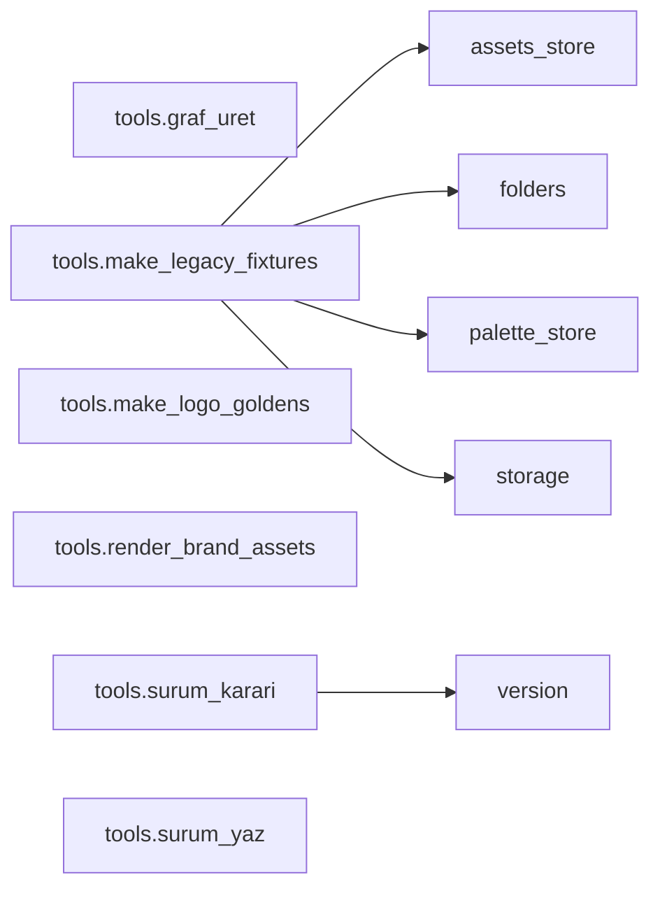

<!-- ÜRETİLMİŞ DOSYA — elle düzenlemeyin. Kaynak: tools/graf_uret.py · yenilemek için: python3 tools/graf_uret.py -->

# Modül grafı

45 Python modülü, 127 modül düzeyi + 13 erteli ithal kenarı.

Katman, o modülün depo içindeki en uzun bağımlılık zincirinin uzunluğu:
**katman 0 hiçbir depo modülüne dayanmaz**, en üst katman uygulamanın
giriş noktasıdır. Bir modülü değiştirdiğinizde etkilenebilecek yer,
onun `ithal eden` sütunudur — okuma yönü budur.

## Uygulama

```mermaid
flowchart TD
  subgraph katman11["katman 11"]
    n_android_main["android_main<br/>197 satır"]
  end
  subgraph katman10["katman 10"]
    n_desktop["desktop<br/>584 satır"]
  end
  subgraph katman9["katman 9"]
    n_netguard["netguard<br/>160 satır"]
  end
  subgraph katman8["katman 8"]
    n_app["app<br/>2276 satır"]
  end
  subgraph katman7["katman 7"]
    n_chat_providers["chat_providers<br/>130 satır"]
  end
  subgraph katman6["katman 6"]
    n_openai_chat["openai_chat<br/>180 satır"]
  end
  subgraph katman5["katman 5"]
    n_azure_flux_client["azure_flux_client<br/>289 satır"]
    n_azure_mai_client["azure_mai_client<br/>286 satır"]
    n_chat_client["chat_client<br/>190 satır"]
    n_gemini_client["gemini_client<br/>295 satır"]
    n_openai_client["openai_client<br/>217 satır"]
    n_prefs["prefs<br/>249 satır"]
    n_providers["providers<br/>482 satır"]
    n_veo_client["veo_client<br/>578 satır"]
  end
  subgraph katman4["katman 4"]
    n_backup["backup<br/>190 satır"]
    n_color_names["color_names<br/>421 satır"]
    n_credstore["credstore<br/>198 satır"]
    n_models["models<br/>1058 satır"]
  end
  subgraph katman3["katman 3"]
    n_assets_store["assets_store<br/>205 satır"]
    n_azure_client["azure_client<br/>458 satır"]
    n_composite["composite<br/>164 satır"]
    n_etiket["etiket<br/>118 satır"]
    n_folders["folders<br/>252 satır"]
    n_palette["palette<br/>332 satır"]
  end
  subgraph katman2["katman 2"]
    n_chat_prompt["chat_prompt<br/>396 satır"]
    n_guncelleme["guncelleme<br/>356 satır"]
    n_i18n["i18n<br/>305 satır"]
  end
  subgraph katman1["katman 1"]
    n_chat_store["chat_store<br/>256 satır"]
    n_palette_store["palette_store<br/>96 satır"]
    n_paths["paths<br/>306 satır"]
    n_storage["storage<br/>418 satır"]
  end
  subgraph katman0["katman 0"]
    n_catalog["catalog<br/>1247 satır"]
    n_errlog["errlog<br/>117 satır"]
    n_jsonstore["jsonstore<br/>83 satır"]
    n_release_manifest["release_manifest<br/>92 satır"]
    n_screencolor["screencolor<br/>153 satır"]
    n_version["version<br/>30 satır"]
    n_winclr["winclr<br/>337 satır"]
    n_winsec["winsec<br/>308 satır"]
  end
  n_android_main -.->|erteli| n_app
  n_android_main -.->|erteli| n_desktop
  n_android_main -.->|erteli| n_errlog
  n_android_main -.->|erteli| n_paths
  n_app --> n_assets_store
  n_app --> n_azure_client
  n_app --> n_backup
  n_app --> n_catalog
  n_app --> n_chat_client
  n_app --> n_chat_prompt
  n_app --> n_chat_providers
  n_app --> n_chat_store
  n_app --> n_color_names
  n_app --> n_composite
  n_app --> n_credstore
  n_app --> n_errlog
  n_app --> n_etiket
  n_app --> n_folders
  n_app --> n_guncelleme
  n_app --> n_i18n
  n_app --> n_models
  n_app --> n_palette
  n_app --> n_palette_store
  n_app --> n_paths
  n_app --> n_prefs
  n_app --> n_providers
  n_app --> n_storage
  n_app --> n_version
  n_assets_store --> n_i18n
  n_assets_store --> n_jsonstore
  n_azure_client --> n_i18n
  n_azure_client --> n_paths
  n_azure_client --> n_winsec
  n_azure_flux_client --> n_azure_client
  n_azure_flux_client --> n_catalog
  n_azure_flux_client --> n_credstore
  n_azure_flux_client --> n_i18n
  n_azure_flux_client --> n_providers
  n_azure_mai_client --> n_azure_client
  n_azure_mai_client --> n_catalog
  n_azure_mai_client --> n_credstore
  n_azure_mai_client --> n_i18n
  n_azure_mai_client --> n_providers
  n_backup --> n_assets_store
  n_backup --> n_chat_store
  n_backup --> n_folders
  n_backup --> n_jsonstore
  n_backup --> n_palette_store
  n_backup --> n_storage
  n_chat_client --> n_azure_client
  n_chat_client --> n_chat_prompt
  n_chat_client --> n_i18n
  n_chat_client --> n_models
  n_chat_prompt --> n_paths
  n_chat_providers --> n_azure_client
  n_chat_providers --> n_catalog
  n_chat_providers --> n_chat_client
  n_chat_providers --> n_credstore
  n_chat_providers --> n_etiket
  n_chat_providers --> n_i18n
  n_chat_providers --> n_openai_chat
  n_chat_store --> n_jsonstore
  n_color_names --> n_palette
  n_composite --> n_i18n
  n_credstore --> n_azure_client
  n_credstore --> n_catalog
  n_credstore --> n_etiket
  n_credstore --> n_i18n
  n_desktop --> n_errlog
  n_desktop --> n_i18n
  n_desktop --> n_netguard
  n_desktop --> n_paths
  n_desktop --> n_screencolor
  n_desktop --> n_version
  n_desktop --> n_winclr
  n_desktop -.->|erteli| n_app
  n_desktop -.->|erteli| n_prefs
  n_etiket --> n_catalog
  n_etiket --> n_i18n
  n_folders --> n_i18n
  n_folders --> n_jsonstore
  n_folders --> n_storage
  n_gemini_client --> n_azure_client
  n_gemini_client --> n_catalog
  n_gemini_client --> n_credstore
  n_gemini_client --> n_i18n
  n_gemini_client --> n_providers
  n_guncelleme --> n_errlog
  n_guncelleme --> n_jsonstore
  n_guncelleme --> n_paths
  n_guncelleme --> n_version
  n_i18n --> n_paths
  n_models --> n_azure_client
  n_models --> n_catalog
  n_models --> n_etiket
  n_models --> n_i18n
  n_models --> n_palette
  n_netguard -.->|erteli| n_app
  n_openai_chat --> n_azure_client
  n_openai_chat --> n_catalog
  n_openai_chat --> n_chat_client
  n_openai_chat --> n_chat_prompt
  n_openai_chat --> n_credstore
  n_openai_chat --> n_etiket
  n_openai_chat --> n_i18n
  n_openai_chat --> n_providers
  n_openai_client --> n_azure_client
  n_openai_client --> n_catalog
  n_openai_client --> n_credstore
  n_openai_client --> n_i18n
  n_openai_client --> n_providers
  n_palette --> n_i18n
  n_palette_store --> n_jsonstore
  n_paths --> n_errlog
  n_prefs --> n_catalog
  n_prefs --> n_i18n
  n_prefs --> n_jsonstore
  n_prefs --> n_models
  n_providers --> n_azure_client
  n_providers --> n_catalog
  n_providers --> n_credstore
  n_providers --> n_etiket
  n_providers --> n_i18n
  n_providers -.->|erteli| n_azure_flux_client
  n_providers -.->|erteli| n_azure_mai_client
  n_providers -.->|erteli| n_gemini_client
  n_providers -.->|erteli| n_openai_client
  n_providers -.->|erteli| n_veo_client
  n_storage --> n_catalog
  n_storage --> n_jsonstore
  n_veo_client --> n_azure_client
  n_veo_client --> n_catalog
  n_veo_client --> n_credstore
  n_veo_client --> n_i18n
  n_veo_client --> n_providers
```

## Döngüler

Birbirini ithal eden öbekler. Kesikli (`erteli`) bir kenarla
kırılmış döngü KUSUR DEĞİL — işlev içinde yapılan ithal, import
anında bir zincir kurmuyor (bkz. providers.py'nin gerekçesi).

* azure_flux_client ↔ azure_mai_client ↔ gemini_client ↔ openai_client ↔ providers ↔ veo_client — erteli bir ithalle kırılmış

## Modüller

| modül | satır | katman | ithal ettiği | ithal eden | test |
| --- | --- | --- | --- | --- | --- |
| `android_main.py` | 197 | 11 | `app` (erteli), `desktop` (erteli), `errlog` (erteli), `paths` (erteli) | 0 | 2 |
| `app.py` | 2276 | 8 | `assets_store`, `azure_client`, `backup`, `catalog`, `chat_client`, `chat_prompt`, `chat_providers`, `chat_store`, `color_names`, `composite`, `credstore`, `errlog`, `etiket`, `folders`, `guncelleme`, `i18n`, `models`, `palette`, `palette_store`, `paths`, `prefs`, `providers`, `storage`, `version` | 3 | 35 |
| `assets_store.py` | 205 | 3 | `i18n`, `jsonstore` | 3 | 9 |
| `azure_client.py` | 458 | 3 | `i18n`, `paths`, `winsec` | 12 | 30 |
| `azure_flux_client.py` | 289 | 5 | `azure_client`, `catalog`, `credstore`, `i18n`, `providers` | 1 | 1 |
| `azure_mai_client.py` | 286 | 5 | `azure_client`, `catalog`, `credstore`, `i18n`, `providers` | 1 | 1 |
| `backup.py` | 190 | 4 | `assets_store`, `chat_store`, `folders`, `jsonstore`, `palette_store`, `storage` | 1 | 1 |
| `catalog.py` | 1247 | 0 | — | 14 | 28 |
| `chat_client.py` | 190 | 5 | `azure_client`, `chat_prompt`, `i18n`, `models` | 3 | 3 |
| `chat_prompt.py` | 396 | 2 | `paths` | 3 | 1 |
| `chat_providers.py` | 130 | 7 | `azure_client`, `catalog`, `chat_client`, `credstore`, `etiket`, `i18n`, `openai_chat` | 1 | 2 |
| `chat_store.py` | 256 | 1 | `jsonstore` | 2 | 2 |
| `color_names.py` | 421 | 4 | `palette` | 1 | 3 |
| `composite.py` | 164 | 3 | `i18n` | 1 | 1 |
| `credstore.py` | 198 | 4 | `azure_client`, `catalog`, `etiket`, `i18n` | 9 | 5 |
| `desktop.py` | 584 | 10 | `errlog`, `i18n`, `netguard`, `paths`, `screencolor`, `version`, `winclr`, `app` (erteli), `prefs` (erteli) | 1 | 2 |
| `errlog.py` | 117 | 0 | — | 5 | 1 |
| `etiket.py` | 118 | 3 | `catalog`, `i18n` | 6 | 1 |
| `folders.py` | 252 | 3 | `i18n`, `jsonstore`, `storage` | 3 | 4 |
| `gemini_client.py` | 295 | 5 | `azure_client`, `catalog`, `credstore`, `i18n`, `providers` | 1 | 1 |
| `guncelleme.py` | 356 | 2 | `errlog`, `jsonstore`, `paths`, `version` | 1 | 5 |
| `i18n.py` | 305 | 2 | `paths` | 20 | 3 |
| `jsonstore.py` | 83 | 0 | — | 8 | 1 |
| `models.py` | 1058 | 4 | `azure_client`, `catalog`, `etiket`, `i18n`, `palette` | 3 | 14 |
| `netguard.py` | 160 | 9 | `app` (erteli) | 1 | 1 |
| `openai_chat.py` | 180 | 6 | `azure_client`, `catalog`, `chat_client`, `chat_prompt`, `credstore`, `etiket`, `i18n`, `providers` | 1 | 3 |
| `openai_client.py` | 217 | 5 | `azure_client`, `catalog`, `credstore`, `i18n`, `providers` | 1 | 1 |
| `palette.py` | 332 | 3 | `i18n` | 3 | 3 |
| `palette_store.py` | 96 | 1 | `jsonstore` | 3 | 3 |
| `paths.py` | 306 | 1 | `errlog` | 7 | 4 |
| `prefs.py` | 249 | 5 | `catalog`, `i18n`, `jsonstore`, `models` | 2 | 6 |
| `providers.py` | 482 | 5 | `azure_client`, `catalog`, `credstore`, `etiket`, `i18n`, `azure_flux_client` (erteli), `azure_mai_client` (erteli), `gemini_client` (erteli), `openai_client` (erteli), `veo_client` (erteli) | 7 | 7 |
| `release_manifest.py` | 92 | 0 | — | 0 | 2 |
| `screencolor.py` | 153 | 0 | — | 1 | 1 |
| `storage.py` | 418 | 1 | `catalog`, `jsonstore` | 4 | 10 |
| `veo_client.py` | 578 | 5 | `azure_client`, `catalog`, `credstore`, `i18n`, `providers` | 1 | 1 |
| `version.py` | 30 | 0 | — | 4 | 9 |
| `winclr.py` | 337 | 0 | — | 1 | 1 |
| `winsec.py` | 308 | 0 | — | 1 | 2 |

## Giriş noktaları ve öksüzler

Kimsenin ithal etmediği modüller. `app`, `desktop`, `android_main` uygulamanın giriş noktaları — geri kalanı ya bir betikten çağrılıyor ya da artık kullanılmıyor; ikincisi bir bulgudur.

* `android_main` — giriş noktası
* `release_manifest` — ithal eden yok — kullanımı elle doğrulanmalı

## Yardımcılar (`tools/`)

Pakete girmiyor, çalışma zamanına dokunmuyor (bkz. tools/__init__.py).

