<!-- ÜRETİLMİŞ DOSYA — elle düzenlemeyin. Kaynak: tools/graf_uret.py · yenilemek için: python3 tools/graf_uret.py -->

# Modül grafı

114 Python modülü, 499 modül düzeyi + 16 erteli ithal kenarı.

Katman, o modülün depo içindeki en uzun bağımlılık zincirinin uzunluğu:
**katman 0 hiçbir depo modülüne dayanmaz**, en üst katman uygulamanın
giriş noktasıdır. Bir modülü değiştirdiğinizde etkilenebilecek yer,
onun `ithal eden` sütunudur — okuma yönü budur.

## Uygulama

```mermaid
flowchart TD
  subgraph katman16["katman 16"]
    n_android_main["android_main<br/>204 satır"]
  end
  subgraph katman15["katman 15"]
    n_desktop["desktop<br/>588 satır"]
  end
  subgraph katman14["katman 14"]
    n_netguard["netguard<br/>169 satır"]
  end
  subgraph katman13["katman 13"]
    n_app["app<br/>299 satır"]
  end
  subgraph katman12["katman 12"]
    n_isci["isci<br/>382 satır"]
    n_routers_admin["routers.admin<br/>204 satır"]
    n_routers_ayarlar["routers.ayarlar<br/>403 satır"]
    n_routers_bindirme["routers.bindirme<br/>282 satır"]
    n_routers_galeri["routers.galeri<br/>401 satır"]
    n_routers_isler["routers.isler<br/>381 satır"]
    n_routers_odeme["routers.odeme<br/>105 satır"]
    n_routers_saglik["routers.saglik<br/>169 satır"]
    n_routers_sohbet["routers.sohbet<br/>241 satır"]
    n_routers_uretim["routers.uretim<br/>548 satır"]
  end
  subgraph katman11["katman 11"]
    n_routers_hesap["routers.hesap<br/>273 satır"]
    n_routers_kok["routers.kok<br/>40 satır"]
    n_services_depo_admin["services.depo_admin<br/>401 satır"]
    n_services_isci["services.isci<br/>796 satır"]
    n_services_kapilar["services.kapilar<br/>285 satır"]
    n_services_odeme["services.odeme<br/>506 satır"]
  end
  subgraph katman10["katman 10"]
    n_services_kuyruk["services.kuyruk<br/>552 satır"]
    n_services_sablon["services.sablon<br/>68 satır"]
  end
  subgraph katman9["katman 9"]
    n_routers_paletler["routers.paletler<br/>101 satır"]
    n_services_ayar["services.ayar<br/>226 satır"]
  end
  subgraph katman8["katman 8"]
    n_services_kimlik["services.kimlik<br/>265 satır"]
    n_services_modeller["services.modeller<br/>371 satır"]
  end
  subgraph katman7["katman 7"]
    n_chat_providers["chat_providers<br/>133 satır"]
    n_services_defter["services.defter<br/>595 satır"]
    n_services_depo_klasor["services.depo_klasor<br/>232 satır"]
    n_services_palet["services.palet<br/>185 satır"]
    n_services_platform_anahtari["services.platform_anahtari<br/>159 satır"]
  end
  subgraph katman6["katman 6"]
    n_openai_chat["openai_chat<br/>180 satır"]
    n_services_depo_kimlik_bilgisi["services.depo_kimlik_bilgisi<br/>143 satır"]
    n_services_depo_medya["services.depo_medya<br/>367 satır"]
    n_services_depo_palet["services.depo_palet<br/>82 satır"]
    n_services_depo_sohbet["services.depo_sohbet<br/>143 satır"]
    n_services_depo_tercih["services.depo_tercih<br/>112 satır"]
    n_services_depo_varlik["services.depo_varlik<br/>132 satır"]
    n_services_hesap["services.hesap<br/>292 satır"]
    n_services_kota["services.kota<br/>183 satır"]
    n_services_planlar["services.planlar<br/>180 satır"]
  end
  subgraph katman5["katman 5"]
    n_azure_flux_client["azure_flux_client<br/>289 satır"]
    n_azure_mai_client["azure_mai_client<br/>290 satır"]
    n_chat_client["chat_client<br/>218 satır"]
    n_fal_client["fal_client<br/>761 satır"]
    n_gemini_client["gemini_client<br/>295 satır"]
    n_openai_client["openai_client<br/>217 satır"]
    n_prefs["prefs<br/>268 satır"]
    n_providers["providers<br/>508 satır"]
    n_services_filigran["services.filigran<br/>128 satır"]
    n_services_tablolar["services.tablolar<br/>885 satır"]
    n_veo_client["veo_client<br/>629 satır"]
  end
  subgraph katman4["katman 4"]
    n_backup["backup<br/>190 satır"]
    n_color_names["color_names<br/>421 satır"]
    n_credstore["credstore<br/>228 satır"]
    n_models["models<br/>1138 satır"]
    n_services_gorsel["services.gorsel<br/>123 satır"]
  end
  subgraph katman3["katman 3"]
    n_assets_store["assets_store<br/>205 satır"]
    n_azure_client["azure_client<br/>518 satır"]
    n_composite["composite<br/>176 satır"]
    n_etiket["etiket<br/>118 satır"]
    n_folders["folders<br/>253 satır"]
    n_palette["palette<br/>333 satır"]
    n_services_dil["services.dil<br/>194 satır"]
    n_services_istek_kimligi["services.istek_kimligi<br/>112 satır"]
    n_services_posta["services.posta<br/>187 satır"]
  end
  subgraph katman2["katman 2"]
    n_chat_prompt["chat_prompt<br/>396 satır"]
    n_guncelleme["guncelleme<br/>379 satır"]
    n_i18n["i18n<br/>305 satır"]
    n_services_cerez["services.cerez<br/>82 satır"]
    n_services_hata_izleme["services.hata_izleme<br/>187 satır"]
  end
  subgraph katman1["katman 1"]
    n_chat_store["chat_store<br/>258 satır"]
    n_palette_store["palette_store<br/>96 satır"]
    n_paths["paths<br/>326 satır"]
    n_services_db["services.db<br/>225 satır"]
    n_services_dosya["services.dosya<br/>328 satır"]
    n_services_gunluk["services.gunluk<br/>332 satır"]
    n_services_redaksiyon["services.redaksiyon<br/>68 satır"]
    n_storage["storage<br/>423 satır"]
  end
  subgraph katman0["katman 0"]
    n_catalog["catalog<br/>1493 satır"]
    n_errlog["errlog<br/>133 satır"]
    n_jsonstore["jsonstore<br/>83 satır"]
    n_kimlik_baglami["kimlik_baglami<br/>56 satır"]
    n_release_manifest["release_manifest<br/>92 satır"]
    n_screencolor["screencolor<br/>149 satır"]
    n_services_kiraci["services.kiraci<br/>200 satır"]
    n_services_koken["services.koken<br/>133 satır"]
    n_services_nesne_depo["services.nesne_depo<br/>317 satır"]
    n_services_polar["services.polar<br/>210 satır"]
    n_services_saglayici_meta["services.saglayici_meta<br/>126 satır"]
    n_services_sifre["services.sifre<br/>151 satır"]
    n_services_zaman["services.zaman<br/>71 satır"]
    n_version["version<br/>30 satır"]
    n_winclr["winclr<br/>339 satır"]
    n_winsec["winsec<br/>308 satır"]
  end
  n_android_main -.->|erteli| n_app
  n_android_main -.->|erteli| n_desktop
  n_android_main -.->|erteli| n_errlog
  n_android_main -.->|erteli| n_paths
  n_app --> n_catalog
  n_app --> n_chat_client
  n_app --> n_chat_prompt
  n_app --> n_composite
  n_app --> n_credstore
  n_app --> n_errlog
  n_app --> n_models
  n_app --> n_paths
  n_app --> n_providers
  n_app --> n_routers_admin
  n_app --> n_routers_ayarlar
  n_app --> n_routers_bindirme
  n_app --> n_routers_galeri
  n_app --> n_routers_hesap
  n_app --> n_routers_isler
  n_app --> n_routers_kok
  n_app --> n_routers_odeme
  n_app --> n_routers_paletler
  n_app --> n_routers_saglik
  n_app --> n_routers_sohbet
  n_app --> n_routers_uretim
  n_app --> n_services_ayar
  n_app --> n_services_db
  n_app --> n_services_dil
  n_app --> n_services_dosya
  n_app --> n_services_gorsel
  n_app --> n_services_gunluk
  n_app --> n_services_hata_izleme
  n_app --> n_services_istek_kimligi
  n_app --> n_services_kimlik
  n_app --> n_services_koken
  n_app --> n_services_modeller
  n_app --> n_services_palet
  n_app --> n_services_posta
  n_app --> n_services_redaksiyon
  n_app --> n_services_sifre
  n_assets_store --> n_i18n
  n_assets_store --> n_jsonstore
  n_azure_client --> n_i18n
  n_azure_client --> n_kimlik_baglami
  n_azure_client --> n_paths
  n_azure_client --> n_winsec
  n_azure_flux_client --> n_azure_client
  n_azure_flux_client --> n_catalog
  n_azure_flux_client --> n_credstore
  n_azure_flux_client --> n_i18n
  n_azure_flux_client --> n_providers
  n_azure_mai_client --> n_azure_client
  n_azure_mai_client --> n_catalog
  n_azure_mai_client --> n_credstore
  n_azure_mai_client --> n_i18n
  n_azure_mai_client --> n_providers
  n_azure_mai_client --> n_services_saglayici_meta
  n_backup --> n_assets_store
  n_backup --> n_chat_store
  n_backup --> n_folders
  n_backup --> n_jsonstore
  n_backup --> n_palette_store
  n_backup --> n_storage
  n_chat_client --> n_azure_client
  n_chat_client --> n_chat_prompt
  n_chat_client --> n_i18n
  n_chat_client --> n_kimlik_baglami
  n_chat_client --> n_models
  n_chat_prompt --> n_paths
  n_chat_providers --> n_catalog
  n_chat_providers --> n_chat_client
  n_chat_providers --> n_credstore
  n_chat_providers --> n_etiket
  n_chat_providers --> n_i18n
  n_chat_providers --> n_openai_chat
  n_chat_store --> n_jsonstore
  n_color_names --> n_palette
  n_composite --> n_i18n
  n_credstore --> n_azure_client
  n_credstore --> n_catalog
  n_credstore --> n_etiket
  n_credstore --> n_i18n
  n_credstore --> n_kimlik_baglami
  n_desktop --> n_errlog
  n_desktop --> n_i18n
  n_desktop --> n_netguard
  n_desktop --> n_paths
  n_desktop --> n_screencolor
  n_desktop --> n_version
  n_desktop --> n_winclr
  n_desktop -.->|erteli| n_app
  n_desktop -.->|erteli| n_prefs
  n_etiket --> n_catalog
  n_etiket --> n_i18n
  n_fal_client --> n_azure_client
  n_fal_client --> n_catalog
  n_fal_client --> n_credstore
  n_fal_client --> n_i18n
  n_fal_client --> n_providers
  n_fal_client --> n_services_saglayici_meta
  n_folders --> n_i18n
  n_folders --> n_jsonstore
  n_folders --> n_storage
  n_gemini_client --> n_azure_client
  n_gemini_client --> n_catalog
  n_gemini_client --> n_credstore
  n_gemini_client --> n_i18n
  n_gemini_client --> n_providers
  n_guncelleme --> n_errlog
  n_guncelleme --> n_jsonstore
  n_guncelleme --> n_paths
  n_guncelleme --> n_version
  n_guncelleme -.->|erteli| n_services_db
  n_i18n --> n_paths
  n_isci --> n_errlog
  n_isci --> n_services_ayar
  n_isci --> n_services_db
  n_isci --> n_services_dosya
  n_isci --> n_services_gunluk
  n_isci --> n_services_hata_izleme
  n_isci --> n_services_isci
  n_isci --> n_services_kuyruk
  n_isci --> n_services_sifre
  n_isci --> n_services_zaman
  n_isci --> n_version
  n_models --> n_catalog
  n_models --> n_etiket
  n_models --> n_i18n
  n_models --> n_palette
  n_netguard -.->|erteli| n_app
  n_openai_chat --> n_azure_client
  n_openai_chat --> n_catalog
  n_openai_chat --> n_chat_client
  n_openai_chat --> n_chat_prompt
  n_openai_chat --> n_credstore
  n_openai_chat --> n_etiket
  n_openai_chat --> n_i18n
  n_openai_chat --> n_providers
  n_openai_client --> n_azure_client
  n_openai_client --> n_catalog
  n_openai_client --> n_credstore
  n_openai_client --> n_i18n
  n_openai_client --> n_providers
  n_palette --> n_i18n
  n_palette_store --> n_jsonstore
  n_paths --> n_errlog
  n_prefs --> n_catalog
  n_prefs --> n_i18n
  n_prefs --> n_jsonstore
  n_prefs --> n_models
  n_providers --> n_azure_client
  n_providers --> n_catalog
  n_providers --> n_credstore
  n_providers --> n_etiket
  n_providers --> n_i18n
  n_providers -.->|erteli| n_azure_flux_client
  n_providers -.->|erteli| n_azure_mai_client
  n_providers -.->|erteli| n_fal_client
  n_providers -.->|erteli| n_gemini_client
  n_providers -.->|erteli| n_openai_client
  n_providers -.->|erteli| n_veo_client
  n_routers_admin --> n_i18n
  n_routers_admin --> n_services_ayar
  n_routers_admin --> n_services_db
  n_routers_admin --> n_services_defter
  n_routers_admin --> n_services_depo_admin
  n_routers_admin --> n_services_dil
  n_routers_admin --> n_services_gunluk
  n_routers_admin --> n_services_hesap
  n_routers_admin --> n_services_kimlik
  n_routers_admin --> n_services_planlar
  n_routers_admin --> n_services_sablon
  n_routers_admin --> n_services_tablolar
  n_routers_admin --> n_services_zaman
  n_routers_ayarlar --> n_azure_client
  n_routers_ayarlar --> n_catalog
  n_routers_ayarlar --> n_guncelleme
  n_routers_ayarlar --> n_i18n
  n_routers_ayarlar --> n_models
  n_routers_ayarlar --> n_paths
  n_routers_ayarlar --> n_services_ayar
  n_routers_ayarlar --> n_services_db
  n_routers_ayarlar --> n_services_depo_kimlik_bilgisi
  n_routers_ayarlar --> n_services_depo_tercih
  n_routers_ayarlar --> n_services_dil
  n_routers_ayarlar --> n_services_kapilar
  n_routers_ayarlar --> n_services_kimlik
  n_routers_ayarlar --> n_services_modeller
  n_routers_ayarlar --> n_services_platform_anahtari
  n_routers_ayarlar --> n_services_tablolar
  n_routers_ayarlar --> n_services_zaman
  n_routers_ayarlar --> n_version
  n_routers_bindirme --> n_composite
  n_routers_bindirme --> n_i18n
  n_routers_bindirme --> n_models
  n_routers_bindirme --> n_services_ayar
  n_routers_bindirme --> n_services_db
  n_routers_bindirme --> n_services_depo_medya
  n_routers_bindirme --> n_services_depo_varlik
  n_routers_bindirme --> n_services_dil
  n_routers_bindirme --> n_services_dosya
  n_routers_bindirme --> n_services_gorsel
  n_routers_bindirme --> n_services_kapilar
  n_routers_bindirme --> n_services_kimlik
  n_routers_bindirme --> n_services_tablolar
  n_routers_bindirme --> n_services_zaman
  n_routers_galeri --> n_i18n
  n_routers_galeri --> n_models
  n_routers_galeri --> n_services_ayar
  n_routers_galeri --> n_services_db
  n_routers_galeri --> n_services_depo_klasor
  n_routers_galeri --> n_services_depo_medya
  n_routers_galeri --> n_services_dil
  n_routers_galeri --> n_services_dosya
  n_routers_galeri --> n_services_gorsel
  n_routers_galeri --> n_services_kapilar
  n_routers_galeri --> n_services_kimlik
  n_routers_galeri --> n_services_tablolar
  n_routers_galeri --> n_services_zaman
  n_routers_galeri --> n_storage
  n_routers_hesap --> n_errlog
  n_routers_hesap --> n_i18n
  n_routers_hesap --> n_models
  n_routers_hesap --> n_services_ayar
  n_routers_hesap --> n_services_cerez
  n_routers_hesap --> n_services_db
  n_routers_hesap --> n_services_defter
  n_routers_hesap --> n_services_dil
  n_routers_hesap --> n_services_hesap
  n_routers_hesap --> n_services_kimlik
  n_routers_hesap --> n_services_kiraci
  n_routers_hesap --> n_services_koken
  n_routers_hesap --> n_services_planlar
  n_routers_hesap --> n_services_posta
  n_routers_hesap --> n_services_sablon
  n_routers_hesap --> n_services_tablolar
  n_routers_isler --> n_catalog
  n_routers_isler --> n_i18n
  n_routers_isler --> n_services_db
  n_routers_isler --> n_services_defter
  n_routers_isler --> n_services_dil
  n_routers_isler --> n_services_kapilar
  n_routers_isler --> n_services_kimlik
  n_routers_isler --> n_services_kota
  n_routers_isler --> n_services_kuyruk
  n_routers_isler --> n_services_planlar
  n_routers_isler --> n_services_platform_anahtari
  n_routers_isler --> n_services_tablolar
  n_routers_isler --> n_services_zaman
  n_routers_kok --> n_services_ayar
  n_routers_kok --> n_services_kimlik
  n_routers_kok --> n_services_sablon
  n_routers_kok --> n_services_tablolar
  n_routers_odeme --> n_services_db
  n_routers_odeme --> n_services_gunluk
  n_routers_odeme --> n_services_kiraci
  n_routers_odeme --> n_services_odeme
  n_routers_odeme --> n_services_polar
  n_routers_paletler --> n_color_names
  n_routers_paletler --> n_i18n
  n_routers_paletler --> n_models
  n_routers_paletler --> n_palette
  n_routers_paletler --> n_services_db
  n_routers_paletler --> n_services_depo_palet
  n_routers_paletler --> n_services_dil
  n_routers_paletler --> n_services_kimlik
  n_routers_paletler --> n_services_palet
  n_routers_paletler --> n_services_tablolar
  n_routers_paletler --> n_services_zaman
  n_routers_saglik --> n_services_ayar
  n_routers_saglik --> n_services_db
  n_routers_saglik --> n_services_depo_admin
  n_routers_saglik --> n_services_kuyruk
  n_routers_saglik --> n_services_zaman
  n_routers_saglik --> n_version
  n_routers_sohbet --> n_catalog
  n_routers_sohbet --> n_chat_client
  n_routers_sohbet --> n_chat_prompt
  n_routers_sohbet --> n_chat_providers
  n_routers_sohbet --> n_i18n
  n_routers_sohbet --> n_models
  n_routers_sohbet --> n_services_db
  n_routers_sohbet --> n_services_depo_sohbet
  n_routers_sohbet --> n_services_depo_tercih
  n_routers_sohbet --> n_services_dil
  n_routers_sohbet --> n_services_kapilar
  n_routers_sohbet --> n_services_kimlik
  n_routers_sohbet --> n_services_modeller
  n_routers_sohbet --> n_services_tablolar
  n_routers_sohbet --> n_services_zaman
  n_routers_uretim --> n_catalog
  n_routers_uretim --> n_etiket
  n_routers_uretim --> n_i18n
  n_routers_uretim --> n_models
  n_routers_uretim --> n_palette
  n_routers_uretim --> n_services_ayar
  n_routers_uretim --> n_services_db
  n_routers_uretim --> n_services_dil
  n_routers_uretim --> n_services_dosya
  n_routers_uretim --> n_services_gorsel
  n_routers_uretim --> n_services_kapilar
  n_routers_uretim --> n_services_kimlik
  n_routers_uretim --> n_services_kota
  n_routers_uretim --> n_services_kuyruk
  n_routers_uretim --> n_services_palet
  n_routers_uretim --> n_services_tablolar
  n_services_ayar --> n_paths
  n_services_ayar --> n_services_kimlik
  n_services_ayar --> n_services_tablolar
  n_services_cerez --> n_services_db
  n_services_db --> n_services_kiraci
  n_services_defter --> n_services_gunluk
  n_services_defter --> n_services_planlar
  n_services_defter --> n_services_tablolar
  n_services_defter --> n_services_zaman
  n_services_depo_admin --> n_catalog
  n_services_depo_admin --> n_services_kota
  n_services_depo_admin --> n_services_kuyruk
  n_services_depo_admin --> n_services_platform_anahtari
  n_services_depo_admin --> n_services_tablolar
  n_services_depo_admin --> n_services_zaman
  n_services_depo_kimlik_bilgisi --> n_catalog
  n_services_depo_kimlik_bilgisi --> n_services_sifre
  n_services_depo_kimlik_bilgisi --> n_services_tablolar
  n_services_depo_kimlik_bilgisi --> n_services_zaman
  n_services_depo_klasor --> n_folders
  n_services_depo_klasor --> n_services_depo_medya
  n_services_depo_klasor --> n_services_dosya
  n_services_depo_klasor --> n_services_tablolar
  n_services_depo_klasor --> n_services_zaman
  n_services_depo_medya --> n_catalog
  n_services_depo_medya --> n_services_dosya
  n_services_depo_medya --> n_services_tablolar
  n_services_depo_medya --> n_services_zaman
  n_services_depo_medya --> n_storage
  n_services_depo_palet --> n_palette_store
  n_services_depo_palet --> n_services_tablolar
  n_services_depo_palet --> n_services_zaman
  n_services_depo_sohbet --> n_chat_store
  n_services_depo_sohbet --> n_services_tablolar
  n_services_depo_sohbet --> n_services_zaman
  n_services_depo_tercih --> n_catalog
  n_services_depo_tercih --> n_prefs
  n_services_depo_tercih --> n_services_tablolar
  n_services_depo_tercih --> n_services_zaman
  n_services_depo_varlik --> n_assets_store
  n_services_depo_varlik --> n_services_dosya
  n_services_depo_varlik --> n_services_tablolar
  n_services_depo_varlik --> n_services_zaman
  n_services_dil --> n_i18n
  n_services_dil --> n_services_cerez
  n_services_dosya --> n_services_nesne_depo
  n_services_filigran --> n_composite
  n_services_filigran --> n_paths
  n_services_filigran --> n_services_gorsel
  n_services_gorsel --> n_i18n
  n_services_gorsel --> n_services_dil
  n_services_gorsel --> n_services_dosya
  n_services_gunluk --> n_errlog
  n_services_hata_izleme --> n_errlog
  n_services_hata_izleme --> n_services_gunluk
  n_services_hata_izleme --> n_version
  n_services_hesap --> n_services_cerez
  n_services_hesap --> n_services_tablolar
  n_services_isci --> n_azure_client
  n_services_isci --> n_catalog
  n_services_isci --> n_errlog
  n_services_isci --> n_i18n
  n_services_isci --> n_kimlik_baglami
  n_services_isci --> n_providers
  n_services_isci --> n_services_ayar
  n_services_isci --> n_services_defter
  n_services_isci --> n_services_depo_kimlik_bilgisi
  n_services_isci --> n_services_depo_medya
  n_services_isci --> n_services_dil
  n_services_isci --> n_services_dosya
  n_services_isci --> n_services_filigran
  n_services_isci --> n_services_gunluk
  n_services_isci --> n_services_hata_izleme
  n_services_isci --> n_services_kiraci
  n_services_isci --> n_services_kuyruk
  n_services_isci --> n_services_nesne_depo
  n_services_isci --> n_services_planlar
  n_services_isci --> n_services_platform_anahtari
  n_services_isci --> n_services_saglayici_meta
  n_services_isci --> n_services_tablolar
  n_services_isci --> n_services_zaman
  n_services_istek_kimligi --> n_services_gunluk
  n_services_istek_kimligi --> n_services_hata_izleme
  n_services_kapilar --> n_assets_store
  n_services_kapilar --> n_catalog
  n_services_kapilar --> n_chat_store
  n_services_kapilar --> n_credstore
  n_services_kapilar --> n_etiket
  n_services_kapilar --> n_i18n
  n_services_kapilar --> n_services_defter
  n_services_kapilar --> n_services_depo_klasor
  n_services_kapilar --> n_services_dil
  n_services_kapilar --> n_services_kuyruk
  n_services_kapilar --> n_services_planlar
  n_services_kapilar --> n_services_platform_anahtari
  n_services_kapilar --> n_services_tablolar
  n_services_kapilar --> n_storage
  n_services_kimlik --> n_i18n
  n_services_kimlik --> n_kimlik_baglami
  n_services_kimlik --> n_services_cerez
  n_services_kimlik --> n_services_db
  n_services_kimlik --> n_services_depo_kimlik_bilgisi
  n_services_kimlik --> n_services_dil
  n_services_kimlik --> n_services_hesap
  n_services_kimlik --> n_services_kiraci
  n_services_kimlik --> n_services_platform_anahtari
  n_services_kimlik --> n_services_tablolar
  n_services_kota --> n_i18n
  n_services_kota --> n_services_dil
  n_services_kota --> n_services_tablolar
  n_services_kota --> n_services_zaman
  n_services_kuyruk --> n_errlog
  n_services_kuyruk --> n_services_ayar
  n_services_kuyruk --> n_services_tablolar
  n_services_kuyruk --> n_services_zaman
  n_services_modeller --> n_catalog
  n_services_modeller --> n_credstore
  n_services_modeller --> n_etiket
  n_services_modeller --> n_i18n
  n_services_modeller --> n_services_defter
  n_services_modeller --> n_services_depo_tercih
  n_services_modeller --> n_services_planlar
  n_services_modeller --> n_services_platform_anahtari
  n_services_modeller --> n_version
  n_services_odeme --> n_services_defter
  n_services_odeme --> n_services_gunluk
  n_services_odeme --> n_services_kuyruk
  n_services_odeme --> n_services_planlar
  n_services_odeme --> n_services_polar
  n_services_odeme --> n_services_tablolar
  n_services_odeme --> n_services_zaman
  n_services_palet --> n_color_names
  n_services_palet --> n_i18n
  n_services_palet --> n_models
  n_services_palet --> n_palette
  n_services_palet --> n_services_depo_palet
  n_services_palet --> n_services_dil
  n_services_planlar --> n_catalog
  n_services_planlar --> n_services_tablolar
  n_services_platform_anahtari --> n_catalog
  n_services_platform_anahtari --> n_services_depo_kimlik_bilgisi
  n_services_posta --> n_errlog
  n_services_posta --> n_i18n
  n_services_redaksiyon --> n_catalog
  n_services_sablon --> n_errlog
  n_services_sablon --> n_i18n
  n_services_sablon --> n_services_ayar
  n_services_sablon --> n_services_dil
  n_services_sablon --> n_version
  n_services_tablolar --> n_assets_store
  n_services_tablolar --> n_models
  n_storage --> n_catalog
  n_storage --> n_jsonstore
  n_veo_client --> n_azure_client
  n_veo_client --> n_catalog
  n_veo_client --> n_credstore
  n_veo_client --> n_i18n
  n_veo_client --> n_providers
```

## Döngüler

Birbirini ithal eden öbekler. Kesikli (`erteli`) bir kenarla
kırılmış döngü KUSUR DEĞİL — işlev içinde yapılan ithal, import
anında bir zincir kurmuyor (bkz. providers.py'nin gerekçesi).

* azure_flux_client ↔ azure_mai_client ↔ fal_client ↔ gemini_client ↔ openai_client ↔ providers ↔ veo_client — erteli bir ithalle kırılmış

## Modüller

| modül | satır | katman | ithal ettiği | ithal eden | test |
| --- | --- | --- | --- | --- | --- |
| `android_main.py` | 204 | 16 | `app` (erteli), `desktop` (erteli), `errlog` (erteli), `paths` (erteli) | 0 | 2 |
| `app.py` | 299 | 13 | `catalog`, `chat_client`, `chat_prompt`, `composite`, `credstore`, `errlog`, `models`, `paths`, `providers`, `routers.admin`, `routers.ayarlar`, `routers.bindirme`, `routers.galeri`, `routers.hesap`, `routers.isler`, `routers.kok`, `routers.odeme`, `routers.paletler`, `routers.saglik`, `routers.sohbet`, `routers.uretim`, `services.ayar`, `services.db`, `services.dil`, `services.dosya`, `services.gorsel`, `services.gunluk`, `services.hata_izleme`, `services.istek_kimligi`, `services.kimlik`, `services.koken`, `services.modeller`, `services.palet`, `services.posta`, `services.redaksiyon`, `services.sifre` | 3 | 59 |
| `assets_store.py` | 205 | 3 | `i18n`, `jsonstore` | 6 | 7 |
| `azure_client.py` | 518 | 3 | `i18n`, `kimlik_baglami`, `paths`, `winsec` | 13 | 39 |
| `azure_flux_client.py` | 289 | 5 | `azure_client`, `catalog`, `credstore`, `i18n`, `providers` | 1 | 1 |
| `azure_mai_client.py` | 290 | 5 | `azure_client`, `catalog`, `credstore`, `i18n`, `providers`, `services.saglayici_meta` | 1 | 2 |
| `backup.py` | 190 | 4 | `assets_store`, `chat_store`, `folders`, `jsonstore`, `palette_store`, `storage` | 0 | 1 |
| `catalog.py` | 1493 | 0 | — | 30 | 44 |
| `chat_client.py` | 218 | 5 | `azure_client`, `chat_prompt`, `i18n`, `kimlik_baglami`, `models` | 4 | 4 |
| `chat_prompt.py` | 396 | 2 | `paths` | 4 | 1 |
| `chat_providers.py` | 133 | 7 | `catalog`, `chat_client`, `credstore`, `etiket`, `i18n`, `openai_chat` | 1 | 2 |
| `chat_store.py` | 258 | 1 | `jsonstore` | 3 | 5 |
| `color_names.py` | 421 | 4 | `palette` | 2 | 3 |
| `composite.py` | 176 | 3 | `i18n` | 3 | 2 |
| `credstore.py` | 228 | 4 | `azure_client`, `catalog`, `etiket`, `i18n`, `kimlik_baglami` | 12 | 7 |
| `desktop.py` | 588 | 15 | `errlog`, `i18n`, `netguard`, `paths`, `screencolor`, `version`, `winclr`, `app` (erteli), `prefs` (erteli) | 1 | 2 |
| `errlog.py` | 133 | 0 | — | 13 | 2 |
| `etiket.py` | 118 | 3 | `catalog`, `i18n` | 8 | 1 |
| `fal_client.py` | 761 | 5 | `azure_client`, `catalog`, `credstore`, `i18n`, `providers`, `services.saglayici_meta` | 1 | 3 |
| `folders.py` | 253 | 3 | `i18n`, `jsonstore`, `storage` | 3 | 5 |
| `gemini_client.py` | 295 | 5 | `azure_client`, `catalog`, `credstore`, `i18n`, `providers` | 1 | 1 |
| `guncelleme.py` | 379 | 2 | `errlog`, `jsonstore`, `paths`, `version`, `services.db` (erteli) | 1 | 6 |
| `i18n.py` | 305 | 2 | `paths` | 39 | 16 |
| `isci.py` | 382 | 12 | `errlog`, `services.ayar`, `services.db`, `services.dosya`, `services.gunluk`, `services.hata_izleme`, `services.isci`, `services.kuyruk`, `services.sifre`, `services.zaman`, `version` | 0 | 0 |
| `jsonstore.py` | 83 | 0 | — | 8 | 1 |
| `kimlik_baglami.py` | 56 | 0 | — | 5 | 3 |
| `models.py` | 1138 | 4 | `catalog`, `etiket`, `i18n`, `palette` | 13 | 18 |
| `netguard.py` | 169 | 14 | `app` (erteli) | 1 | 1 |
| `openai_chat.py` | 180 | 6 | `azure_client`, `catalog`, `chat_client`, `chat_prompt`, `credstore`, `etiket`, `i18n`, `providers` | 1 | 3 |
| `openai_client.py` | 217 | 5 | `azure_client`, `catalog`, `credstore`, `i18n`, `providers` | 1 | 1 |
| `palette.py` | 333 | 3 | `i18n` | 5 | 3 |
| `palette_store.py` | 96 | 1 | `jsonstore` | 3 | 5 |
| `paths.py` | 326 | 1 | `errlog` | 10 | 5 |
| `prefs.py` | 268 | 5 | `catalog`, `i18n`, `jsonstore`, `models` | 3 | 10 |
| `providers.py` | 508 | 5 | `azure_client`, `catalog`, `credstore`, `etiket`, `i18n`, `azure_flux_client` (erteli), `azure_mai_client` (erteli), `fal_client` (erteli), `gemini_client` (erteli), `openai_client` (erteli), `veo_client` (erteli) | 9 | 17 |
| `release_manifest.py` | 92 | 0 | — | 0 | 3 |
| `routers/admin.py` | 204 | 12 | `i18n`, `services.ayar`, `services.db`, `services.defter`, `services.depo_admin`, `services.dil`, `services.gunluk`, `services.hesap`, `services.kimlik`, `services.planlar`, `services.sablon`, `services.tablolar`, `services.zaman` | 1 | 0 |
| `routers/ayarlar.py` | 403 | 12 | `azure_client`, `catalog`, `guncelleme`, `i18n`, `models`, `paths`, `services.ayar`, `services.db`, `services.depo_kimlik_bilgisi`, `services.depo_tercih`, `services.dil`, `services.kapilar`, `services.kimlik`, `services.modeller`, `services.platform_anahtari`, `services.tablolar`, `services.zaman`, `version` | 1 | 0 |
| `routers/bindirme.py` | 282 | 12 | `composite`, `i18n`, `models`, `services.ayar`, `services.db`, `services.depo_medya`, `services.depo_varlik`, `services.dil`, `services.dosya`, `services.gorsel`, `services.kapilar`, `services.kimlik`, `services.tablolar`, `services.zaman` | 1 | 0 |
| `routers/galeri.py` | 401 | 12 | `i18n`, `models`, `services.ayar`, `services.db`, `services.depo_klasor`, `services.depo_medya`, `services.dil`, `services.dosya`, `services.gorsel`, `services.kapilar`, `services.kimlik`, `services.tablolar`, `services.zaman`, `storage` | 1 | 0 |
| `routers/hesap.py` | 273 | 11 | `errlog`, `i18n`, `models`, `services.ayar`, `services.cerez`, `services.db`, `services.defter`, `services.dil`, `services.hesap`, `services.kimlik`, `services.kiraci`, `services.koken`, `services.planlar`, `services.posta`, `services.sablon`, `services.tablolar` | 1 | 2 |
| `routers/isler.py` | 381 | 12 | `catalog`, `i18n`, `services.db`, `services.defter`, `services.dil`, `services.kapilar`, `services.kimlik`, `services.kota`, `services.kuyruk`, `services.planlar`, `services.platform_anahtari`, `services.tablolar`, `services.zaman` | 1 | 3 |
| `routers/kok.py` | 40 | 11 | `services.ayar`, `services.kimlik`, `services.sablon`, `services.tablolar` | 1 | 0 |
| `routers/odeme.py` | 105 | 12 | `services.db`, `services.gunluk`, `services.kiraci`, `services.odeme`, `services.polar` | 1 | 0 |
| `routers/paletler.py` | 101 | 9 | `color_names`, `i18n`, `models`, `palette`, `services.db`, `services.depo_palet`, `services.dil`, `services.kimlik`, `services.palet`, `services.tablolar`, `services.zaman` | 1 | 0 |
| `routers/saglik.py` | 169 | 12 | `services.ayar`, `services.db`, `services.depo_admin`, `services.kuyruk`, `services.zaman`, `version` | 1 | 3 |
| `routers/sohbet.py` | 241 | 12 | `catalog`, `chat_client`, `chat_prompt`, `chat_providers`, `i18n`, `models`, `services.db`, `services.depo_sohbet`, `services.depo_tercih`, `services.dil`, `services.kapilar`, `services.kimlik`, `services.modeller`, `services.tablolar`, `services.zaman` | 1 | 0 |
| `routers/uretim.py` | 548 | 12 | `catalog`, `etiket`, `i18n`, `models`, `palette`, `services.ayar`, `services.db`, `services.dil`, `services.dosya`, `services.gorsel`, `services.kapilar`, `services.kimlik`, `services.kota`, `services.kuyruk`, `services.palet`, `services.tablolar` | 1 | 0 |
| `screencolor.py` | 149 | 0 | — | 1 | 1 |
| `services/ayar.py` | 226 | 9 | `paths`, `services.kimlik`, `services.tablolar` | 16 | 11 |
| `services/cerez.py` | 82 | 2 | `services.db` | 4 | 6 |
| `services/db.py` | 225 | 1 | `services.kiraci` | 24 | 17 |
| `services/defter.py` | 595 | 7 | `services.gunluk`, `services.planlar`, `services.tablolar`, `services.zaman` | 7 | 13 |
| `services/depo_admin.py` | 401 | 11 | `catalog`, `services.kota`, `services.kuyruk`, `services.platform_anahtari`, `services.tablolar`, `services.zaman` | 3 | 5 |
| `services/depo_kimlik_bilgisi.py` | 143 | 6 | `catalog`, `services.sifre`, `services.tablolar`, `services.zaman` | 6 | 7 |
| `services/depo_klasor.py` | 232 | 7 | `folders`, `services.depo_medya`, `services.dosya`, `services.tablolar`, `services.zaman` | 2 | 5 |
| `services/depo_medya.py` | 367 | 6 | `catalog`, `services.dosya`, `services.tablolar`, `services.zaman`, `storage` | 4 | 9 |
| `services/depo_palet.py` | 82 | 6 | `palette_store`, `services.tablolar`, `services.zaman` | 2 | 2 |
| `services/depo_sohbet.py` | 143 | 6 | `chat_store`, `services.tablolar`, `services.zaman` | 1 | 2 |
| `services/depo_tercih.py` | 112 | 6 | `catalog`, `prefs`, `services.tablolar`, `services.zaman` | 4 | 4 |
| `services/depo_varlik.py` | 132 | 6 | `assets_store`, `services.dosya`, `services.tablolar`, `services.zaman` | 1 | 8 |
| `services/dil.py` | 194 | 3 | `i18n`, `services.cerez` | 17 | 5 |
| `services/dosya.py` | 328 | 1 | `services.nesne_depo` | 12 | 9 |
| `services/filigran.py` | 128 | 5 | `composite`, `paths`, `services.gorsel` | 2 | 3 |
| `services/gorsel.py` | 123 | 4 | `i18n`, `services.dil`, `services.dosya` | 5 | 4 |
| `services/gunluk.py` | 332 | 1 | `errlog` | 9 | 5 |
| `services/hata_izleme.py` | 187 | 2 | `errlog`, `services.gunluk`, `version` | 4 | 2 |
| `services/hesap.py` | 292 | 6 | `services.cerez`, `services.tablolar` | 6 | 21 |
| `services/isci.py` | 796 | 11 | `azure_client`, `catalog`, `errlog`, `i18n`, `kimlik_baglami`, `providers`, `services.ayar`, `services.defter`, `services.depo_kimlik_bilgisi`, `services.depo_medya`, `services.dil`, `services.dosya`, `services.filigran`, `services.gunluk`, `services.hata_izleme`, `services.kiraci`, `services.kuyruk`, `services.nesne_depo`, `services.planlar`, `services.platform_anahtari`, `services.saglayici_meta`, `services.tablolar`, `services.zaman` | 1 | 10 |
| `services/istek_kimligi.py` | 112 | 3 | `services.gunluk`, `services.hata_izleme` | 1 | 3 |
| `services/kapilar.py` | 285 | 11 | `assets_store`, `catalog`, `chat_store`, `credstore`, `etiket`, `i18n`, `services.defter`, `services.depo_klasor`, `services.dil`, `services.kuyruk`, `services.planlar`, `services.platform_anahtari`, `services.tablolar`, `storage` | 6 | 8 |
| `services/kimlik.py` | 265 | 8 | `i18n`, `kimlik_baglami`, `services.cerez`, `services.db`, `services.depo_kimlik_bilgisi`, `services.dil`, `services.hesap`, `services.kiraci`, `services.platform_anahtari`, `services.tablolar` | 12 | 3 |
| `services/kiraci.py` | 200 | 0 | — | 12 | 6 |
| `services/koken.py` | 133 | 0 | — | 2 | 5 |
| `services/kota.py` | 183 | 6 | `i18n`, `services.dil`, `services.tablolar`, `services.zaman` | 3 | 5 |
| `services/kuyruk.py` | 552 | 10 | `errlog`, `services.ayar`, `services.tablolar`, `services.zaman` | 9 | 14 |
| `services/modeller.py` | 371 | 8 | `catalog`, `credstore`, `etiket`, `i18n`, `services.defter`, `services.depo_tercih`, `services.planlar`, `services.platform_anahtari`, `version` | 3 | 1 |
| `services/nesne_depo.py` | 317 | 0 | — | 2 | 5 |
| `services/odeme.py` | 506 | 11 | `services.defter`, `services.gunluk`, `services.kuyruk`, `services.planlar`, `services.polar`, `services.tablolar`, `services.zaman` | 1 | 1 |
| `services/palet.py` | 185 | 7 | `color_names`, `i18n`, `models`, `palette`, `services.depo_palet`, `services.dil` | 3 | 1 |
| `services/planlar.py` | 180 | 6 | `catalog`, `services.tablolar` | 8 | 6 |
| `services/platform_anahtari.py` | 159 | 7 | `catalog`, `services.depo_kimlik_bilgisi` | 7 | 7 |
| `services/polar.py` | 210 | 0 | — | 2 | 2 |
| `services/posta.py` | 187 | 3 | `errlog`, `i18n` | 2 | 4 |
| `services/redaksiyon.py` | 68 | 1 | `catalog` | 1 | 0 |
| `services/sablon.py` | 68 | 10 | `errlog`, `i18n`, `services.ayar`, `services.dil`, `version` | 3 | 0 |
| `services/saglayici_meta.py` | 126 | 0 | — | 3 | 1 |
| `services/sifre.py` | 151 | 0 | — | 5 | 5 |
| `services/tablolar.py` | 885 | 5 | `assets_store`, `models` | 33 | 34 |
| `services/zaman.py` | 71 | 0 | — | 23 | 17 |
| `storage.py` | 423 | 1 | `catalog`, `jsonstore` | 9 | 9 |
| `veo_client.py` | 629 | 5 | `azure_client`, `catalog`, `credstore`, `i18n`, `providers` | 1 | 1 |
| `version.py` | 30 | 0 | — | 9 | 13 |
| `winclr.py` | 339 | 0 | — | 1 | 1 |
| `winsec.py` | 308 | 0 | — | 1 | 2 |

## Giriş noktaları ve öksüzler

Kimsenin ithal etmediği modüller. `app`, `isci`, `desktop`, `android_main` uygulamanın giriş noktaları — geri kalanı ya bir betikten çağrılıyor ya da artık kullanılmıyor; ikincisi bir bulgudur.

* `android_main` — giriş noktası
* `backup` — ithal eden yok — kullanımı elle doğrulanmalı
* `isci` — giriş noktası
* `release_manifest` — ithal eden yok — kullanımı elle doğrulanmalı

## Yardımcılar (`tools/`)

Pakete girmiyor, çalışma zamanına dokunmuyor (bkz. tools/__init__.py).

```mermaid
flowchart LR
  n_tools_anahtar_dondur["tools.anahtar_dondur"]
  n_tools_anahtar_dondur --> n_services_db["services.db"]
  n_tools_anahtar_dondur --> n_services_depo_kimlik_bilgisi["services.depo_kimlik_bilgisi"]
  n_tools_anahtar_dondur --> n_services_kiraci["services.kiraci"]
  n_tools_anahtar_dondur --> n_services_sifre["services.sifre"]
  n_tools_anahtar_dondur --> n_services_tablolar["services.tablolar"]
  n_tools_artik_dosya["tools.artik_dosya"]
  n_tools_artik_dosya --> n_services_ayar["services.ayar"]
  n_tools_artik_dosya --> n_services_db["services.db"]
  n_tools_artik_dosya --> n_services_dosya["services.dosya"]
  n_tools_artik_dosya --> n_services_kiraci["services.kiraci"]
  n_tools_artik_dosya --> n_services_kuyruk["services.kuyruk"]
  n_tools_artik_dosya --> n_services_tablolar["services.tablolar"]
  n_tools_artik_dosya --> n_storage["storage"]
  n_tools_gecici_postgres["tools.gecici_postgres"]
  n_tools_goc["tools.goc"]
  n_tools_goc --> n_services_db["services.db"]
  n_tools_graf_uret["tools.graf_uret"]
  n_tools_ice_aktar["tools.ice_aktar"]
  n_tools_ice_aktar --> n_assets_store["assets_store"]
  n_tools_ice_aktar --> n_azure_client["azure_client"]
  n_tools_ice_aktar --> n_prefs["prefs"]
  n_tools_ice_aktar --> n_services_ayar["services.ayar"]
  n_tools_ice_aktar --> n_services_db["services.db"]
  n_tools_ice_aktar --> n_services_depo_kimlik_bilgisi["services.depo_kimlik_bilgisi"]
  n_tools_ice_aktar --> n_services_depo_tercih["services.depo_tercih"]
  n_tools_ice_aktar --> n_services_hesap["services.hesap"]
  n_tools_ice_aktar --> n_services_kiraci["services.kiraci"]
  n_tools_ice_aktar --> n_services_sifre["services.sifre"]
  n_tools_ice_aktar --> n_services_tablolar["services.tablolar"]
  n_tools_ice_aktar --> n_services_zaman["services.zaman"]
  n_tools_ice_aktar --> n_storage["storage"]
  n_tools_kullanici["tools.kullanici"]
  n_tools_kullanici --> n_models["models"]
  n_tools_kullanici --> n_services_db["services.db"]
  n_tools_kullanici --> n_services_hesap["services.hesap"]
  n_tools_kullanici --> n_services_kiraci["services.kiraci"]
  n_tools_kullanici --> n_services_tablolar["services.tablolar"]
  n_tools_make_filigran["tools.make_filigran"]
  n_tools_make_filigran --> n_services_filigran["services.filigran"]
  n_tools_make_legacy_fixtures["tools.make_legacy_fixtures"]
  n_tools_make_legacy_fixtures --> n_assets_store["assets_store"]
  n_tools_make_legacy_fixtures --> n_folders["folders"]
  n_tools_make_legacy_fixtures --> n_palette_store["palette_store"]
  n_tools_make_legacy_fixtures --> n_storage["storage"]
  n_tools_make_logo_goldens["tools.make_logo_goldens"]
  n_tools_marj_raporu["tools.marj_raporu"]
  n_tools_marj_raporu --> n_services_db["services.db"]
  n_tools_marj_raporu --> n_services_depo_admin["services.depo_admin"]
  n_tools_marj_raporu --> n_services_kiraci["services.kiraci"]
  n_tools_medya_tasi["tools.medya_tasi"]
  n_tools_medya_tasi --> n_services_ayar["services.ayar"]
  n_tools_medya_tasi --> n_services_dosya["services.dosya"]
  n_tools_medya_tasi --> n_storage["storage"]
  n_tools_render_brand_assets["tools.render_brand_assets"]
  n_tools_rls_kontrol["tools.rls_kontrol"]
  n_tools_rls_kontrol --> n_services_db["services.db"]
  n_tools_rls_kontrol --> n_services_kiraci["services.kiraci"]
  n_tools_surum_karari["tools.surum_karari"]
  n_tools_surum_karari --> n_version["version"]
  n_tools_surum_yaz["tools.surum_yaz"]
  n_tools_tarife_kontrol["tools.tarife_kontrol"]
  n_tools_tarife_kontrol --> n_catalog["catalog"]
  n_tools_test_ortami["tools.test_ortami"]
  n_tools_test_ortami --> n_tools_gecici_postgres["tools.gecici_postgres"]
  n_tools_uygulama_rolu["tools.uygulama_rolu"]
  n_tools_uygulama_rolu --> n_services_db["services.db"]
  n_tools_uygulama_rolu --> n_services_hesap["services.hesap"]
  n_tools_uygulama_rolu --> n_services_kiraci["services.kiraci"]
  n_tools_uygulama_rolu --> n_services_tablolar["services.tablolar"]
```



