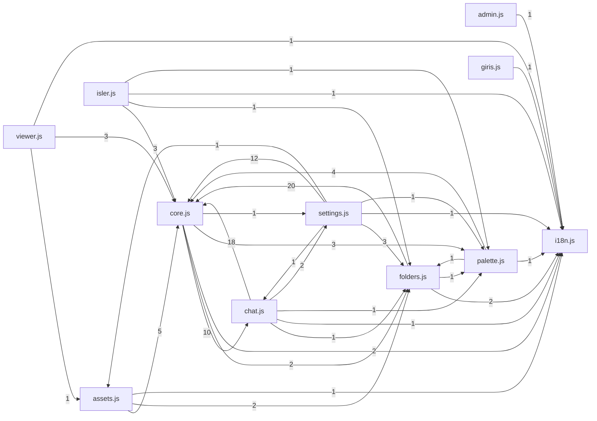

<!-- ÜRETİLMİŞ DOSYA — elle düzenlemeyin. Kaynak: tools/graf_uret.py · yenilemek için: python3 tools/graf_uret.py -->

# Ön yüz grafı

Betikler küresel kapsamda, `static/index.html`'deki SIRAYLA yükleniyor — modül sistemi yok, yani bir betiğin başka bir betiğin işlevini çağırması sıradan. Aşağıdaki kenarlar o çağrılardan çıkarıldı; ağırlık, paylaşılan ad sayısıdır (yöntem ve sınırı: tools/graf_uret.py).

## Yükleme sırası

1. `/static/i18n.js`
2. `/static/pixel-canvas.js`
3. `/static/core.js`
4. `/static/folders.js`
5. `/static/assets.js`
6. `/static/palette.js`
7. `/static/isler.js`
8. `/static/settings.js`
9. `/static/viewer.js`
10. `/static/chat.js`
11. `/static/mobile.js`

Stiller: `/static/fonts.css`, `/static/style.css`, `/static/flow-tokens.css`, `/static/mobile.css`

## Öteki sayfalar

Kendi belgesi olan sayfalar (ör. `/giris`): stüdyonun betikleri yüklenmez, yalnız aşağıdakiler — kapsam ayrı, adlar çakışmaz.

* `static/admin.html` → betikler: `/static/i18n.js`, `/static/admin.js` · stiller: `/static/fonts.css`, `/static/flow-tokens.css`, `/static/admin.css`
* `static/giris.html` → betikler: `/static/i18n.js`, `/static/giris.js` · stiller: `/static/fonts.css`, `/static/flow-tokens.css`, `/static/giris.css`

## Betikler arası çağrı

## Betikler

| betik | satır | üst düzey tanım | çağırdığı sunucu yolları |
| --- | --- | --- | --- |
| `static/admin.js` | 483 | 0 | `/api/admin/isler`, `/api/admin/isler/{}/iptal`, `/api/admin/kullanicilar`, `/api/admin/kullanicilar/{}/kredi`, `/api/admin/kullanicilar/{}/oturum-dusur`, `/api/admin/kullanicilar/{}/plan`, `/api/admin/kullanicilar/{}/tavan`, `/api/admin/metrikler` |
| `static/assets.js` | 586 | 25 | `/api/assets/{}`, `/api/assets/{}/{}`, `/api/banner`, `/api/banner/preview`, `/api/logo`, `/api/logo/preview`, `/assets/banners/{}`, `/assets/logos/{}`, `/assets/mottos/{}`, `/assets/{}/{}`, `/output/{}` |
| `static/chat.js` | 2773 | 90 | `/api/arena/{}`, `/api/arena/{}/winner`, `/api/chat`, `/api/chats`, `/api/chats/{}`, `/api/prefs`, `/output/{}.${videoMu ` |
| `static/core.js` | 3260 | 91 | `/api/edit`, `/api/generate`, `/api/image/{}`, `/api/output/{}/download`, `/api/prefs`, `/api/video`, `/api/video/animate`, `/output/`, `/output/{}`, `/output/{}.png` |
| `static/folders.js` | 2172 | 60 | `/api/folders`, `/api/folders/{}`, `/api/folders/{}/download`, `/api/history`, `/api/images`, `/api/import`, `/output/{}`, `/output/{}${videoMu ` |
| `static/giris.js` | 189 | 0 | `/api/hesap/ben`, `/api/hesap/dogrula`, `/api/hesap/giris`, `/api/hesap/kayit`, `/api/hesap/sifirla`, `/api/hesap/sifirla/dogrula` |
| `static/i18n.js` | 84 | 2 | — |
| `static/isler.js` | 573 | 1 | `/api/hesap/ben`, `/api/history`, `/api/isler`, `/api/isler/akis`, `/api/isler/{}/iptal`, `/api/isler/{}/yeniden`, `/api/kota`, `/output/{}${videoMu ` |
| `static/mobile.js` | 55 | 0 | — |
| `static/palette.js` | 847 | 37 | `/api/palette/suggest`, `/api/palettes`, `/api/palettes/{}` |
| `static/pixel-canvas.js` | 347 | 0 | — |
| `static/settings.js` | 1060 | 26 | `/api/guncelleme`, `/api/hesap/ben`, `/api/hesap/cikis`, `/api/prefs`, `/api/settings` |
| `static/viewer.js` | 540 | 0 | `/output/` |

