<!-- ÜRETİLMİŞ DOSYA — elle düzenlemeyin. Kaynak: tools/graf_uret.py · yenilemek için: python3 tools/graf_uret.py -->

# Uç nokta grafı

81 HTTP rotası, 12 dosyada (`routers/` altındaki alan router'ları; bileşim kökü `app.py` yalnız takıyor). `modüller` sütunu, rotanın gövdesinin VE yardımcılarının (`services/`, aynı router'daki özel işlevler) dokunduğu KÜTÜPHANE modülleridir — yani bir modülü değiştirirken hangi isteklerin sınanması gerektiği burada yazılı; `routers.*`/`services.*` bilerek sütunda yok (gerekçe: tools/graf_uret.py, uc_noktalar). `ön yüz` sütunu o yolu çağıran tarayıcı betiği.

`paths` satırlarda GÖRÜNMÜYOR ve bu bir kör nokta değil, kararın kendisi (Faz 0 / Adım 4): çıktı/varlık dizinleri rotaya `Depends(ayar.ayarlar)` ile gelen ayar nesnesinden okunuyor (`ayarlar.output_dir`), yani bir öznitelik — çağrı değil. `paths`e dokunmak yine neredeyse her ucu etkiler, ama tek bir kapıdan: `app.py`deki `Ayarlar.varsayilan()`. Kiracıya göre dizin (Faz 1) o kapının içini değiştirecek, bu tabloyu değil.

| yöntem | yol | dosya | işlev | modüller | ön yüz |
| --- | --- | --- | --- | --- | --- |
| GET | `/` | `routers/kok.py` | `index`:46 | `errlog`, `i18n`, `version` | — |
| GET | `/admin` | `routers/admin.py` | `admin_sayfasi`:97 | `errlog`, `i18n`, `version` | — |
| GET | `/api/admin/isler` | `routers/admin.py` | `isler`:121 | `i18n` | `admin.js` |
| POST | `/api/admin/isler/{is_id}/iptal` | `routers/admin.py` | `is_iptal`:224 | `i18n` | `admin.js` |
| GET | `/api/admin/kullanicilar` | `routers/admin.py` | `kullanicilar`:104 | — | `admin.js` |
| POST | `/api/admin/kullanicilar/{kullanici_id}/kredi` | `routers/admin.py` | `kredi`:191 | `i18n` | `admin.js` |
| POST | `/api/admin/kullanicilar/{kullanici_id}/oturum-dusur` | `routers/admin.py` | `oturum_dusur`:213 | `i18n` | `admin.js` |
| POST | `/api/admin/kullanicilar/{kullanici_id}/plan` | `routers/admin.py` | `plan`:172 | `i18n` | `admin.js` |
| POST | `/api/admin/kullanicilar/{kullanici_id}/tavan` | `routers/admin.py` | `tavan`:162 | `i18n` | `admin.js` |
| GET | `/api/admin/metrikler` | `routers/admin.py` | `metrikler`:131 | `catalog` | `admin.js` |
| GET | `/api/admin/odeme-olaylari` | `routers/admin.py` | `odeme_olaylari`:139 | — | `admin.js` |
| GET | `/api/arena/{arena_id}` | `routers/galeri.py` | `arena_round_route`:189 | `storage` | `chat.js` |
| POST | `/api/arena/{arena_id}/winner` | `routers/galeri.py` | `set_arena_winner_route`:205 | `i18n`, `models`, `storage` | `chat.js` |
| GET | `/api/assets/{kind}` | `routers/bindirme.py` | `list_assets_route`:243 | `assets_store`, `i18n` | `assets.js` |
| POST | `/api/assets/{kind}` | `routers/bindirme.py` | `upload_asset`:213 | `assets_store`, `i18n` | `assets.js` |
| DELETE | `/api/assets/{kind}/{asset_id}` | `routers/bindirme.py` | `delete_asset_route`:251 | `assets_store`, `i18n` | `assets.js` |
| POST | `/api/banner` | `routers/bindirme.py` | `add_banner`:185 | `assets_store`, `catalog`, `i18n`, `models`, `storage` | `assets.js` |
| POST | `/api/banner/preview` | `routers/bindirme.py` | `preview_banner`:173 | `assets_store`, `i18n`, `models` | `assets.js` |
| POST | `/api/chat` | `routers/sohbet.py` | `chat`:38 | `catalog`, `chat_client`, `chat_prompt`, `chat_providers`, `credstore`, `etiket`, `i18n`, `models`, `prefs` | `chat.js` |
| DELETE | `/api/chats` | `routers/sohbet.py` | `delete_all_chats_route`:202 | — | `chat.js` |
| GET | `/api/chats` | `routers/sohbet.py` | `list_chats_route`:161 | `chat_store` | `chat.js` |
| POST | `/api/chats` | `routers/sohbet.py` | `create_chat_route`:177 | `chat_store`, `i18n`, `models`, `prefs` | `chat.js` |
| DELETE | `/api/chats/{chat_id}` | `routers/sohbet.py` | `delete_chat_route`:236 | `chat_store`, `i18n` | `chat.js` |
| GET | `/api/chats/{chat_id}` | `routers/sohbet.py` | `get_chat_route`:168 | `chat_store`, `i18n` | `chat.js` |
| PUT | `/api/chats/{chat_id}` | `routers/sohbet.py` | `update_chat_route`:213 | `chat_store`, `i18n`, `models`, `prefs` | `chat.js` |
| POST | `/api/edit` | `routers/uretim.py` | `edit`:490 | `catalog`, `chat_store`, `etiket`, `i18n`, `models`, `palette` | `core.js` |
| GET | `/api/folders` | `routers/galeri.py` | `list_folders_route`:48 | — | `folders.js` |
| POST | `/api/folders` | `routers/galeri.py` | `create_folder_route`:70 | `folders`, `i18n`, `models` | `folders.js` |
| DELETE | `/api/folders/{folder_id}` | `routers/galeri.py` | `delete_folder_route`:87 | `folders`, `i18n` | `folders.js` |
| PATCH | `/api/folders/{folder_id}` | `routers/galeri.py` | `rename_folder_route`:151 | `folders`, `i18n`, `models` | `folders.js` |
| GET | `/api/folders/{folder_id}/download` | `routers/galeri.py` | `download_folder_route`:102 | `folders`, `i18n` | `folders.js` |
| POST | `/api/generate` | `routers/uretim.py` | `generate`:159 | `catalog`, `chat_store`, `color_names`, `credstore`, `etiket`, `folders`, `i18n`, `models`, `palette`, `palette_store`, `storage` | `core.js` |
| GET | `/api/guncelleme` | `routers/ayarlar.py` | `get_guncelleme`:114 | `guncelleme`, `prefs` | `settings.js` |
| POST | `/api/guncelleme` | `routers/ayarlar.py` | `post_guncelleme`:149 | `guncelleme`, `prefs` | `settings.js` |
| GET | `/api/hesap/ben` | `routers/hesap.py` | `ben`:344 | — | `giris.js`, `isler.js`, `settings.js` |
| POST | `/api/hesap/cikis` | `routers/hesap.py` | `cikis`:292 | — | `settings.js` |
| GET | `/api/hesap/disa-aktar` | `routers/hesap.py` | `disa_aktar_route`:453 | `assets_store`, `chat_store`, `i18n` | `settings.js` |
| POST | `/api/hesap/dogrula` | `routers/hesap.py` | `dogrula`:243 | `i18n`, `models` | `giris.js` |
| POST | `/api/hesap/giris` | `routers/hesap.py` | `giris`:255 | `errlog`, `i18n`, `models` | `giris.js` |
| POST | `/api/hesap/kayit` | `routers/hesap.py` | `kayit`:205 | `errlog`, `i18n`, `models` | `giris.js` |
| POST | `/api/hesap/sartlar-kabul` | `routers/hesap.py` | `sartlar_kabul`:350 | `i18n` | `settings.js` |
| POST | `/api/hesap/sifirla` | `routers/hesap.py` | `sifirla`:304 | `errlog`, `i18n`, `models` | `giris.js` |
| POST | `/api/hesap/sifirla/dogrula` | `routers/hesap.py` | `sifirla_dogrula`:324 | `i18n`, `models` | `giris.js` |
| POST | `/api/hesap/sil` | `routers/hesap.py` | `sil`:405 | `errlog`, `i18n`, `models` | `settings.js` |
| GET | `/api/history` | `routers/galeri.py` | `history`:165 | `folders`, `i18n` | `folders.js`, `isler.js` |
| DELETE | `/api/image/{image_id}` | `routers/galeri.py` | `delete_image`:222 | `i18n`, `storage` | `core.js` |
| PATCH | `/api/image/{image_id}` | `routers/galeri.py` | `move_image`:178 | `folders`, `i18n`, `models`, `storage` | `core.js` |
| DELETE | `/api/images` | `routers/galeri.py` | `delete_images`:246 | `i18n`, `models`, `storage` | `folders.js` |
| PATCH | `/api/images` | `routers/galeri.py` | `move_images`:234 | `folders`, `i18n`, `models`, `storage` | `folders.js` |
| POST | `/api/import` | `routers/galeri.py` | `import_image`:259 | `i18n` | `folders.js` |
| GET | `/api/isler` | `routers/isler.py` | `isleri_listele`:112 | `i18n` | `isler.js` |
| GET | `/api/isler/akis` | `routers/isler.py` | `isleri_akit`:267 | `i18n` | `isler.js` |
| GET | `/api/isler/{is_id}` | `routers/isler.py` | `is_getir`:298 | `i18n` | `isler.js` |
| POST | `/api/isler/{is_id}/iptal` | `routers/isler.py` | `is_iptal`:305 | `i18n` | `isler.js` |
| POST | `/api/isler/{is_id}/yeniden` | `routers/isler.py` | `is_yeniden`:329 | `catalog`, `credstore`, `etiket`, `i18n` | `isler.js` |
| GET | `/api/kota` | `routers/isler.py` | `kota_durumu`:129 | — | `isler.js` |
| GET | `/api/kredi` | `routers/isler.py` | `kredi_durumu`:171 | — | `core.js`, `planlar.js`, `tesekkur.js` |
| POST | `/api/logo` | `routers/bindirme.py` | `add_logo`:94 | `assets_store`, `catalog`, `composite`, `i18n`, `models`, `storage` | `assets.js` |
| POST | `/api/logo/preview` | `routers/bindirme.py` | `preview_logo`:82 | `assets_store`, `composite`, `i18n`, `models` | `assets.js` |
| POST | `/api/odeme/checkout` | `routers/odeme.py` | `checkout`:160 | — | `planlar.js` |
| GET | `/api/odeme/portal` | `routers/odeme.py` | `portal`:195 | — | `planlar.js`, `settings.js` |
| GET | `/api/odeme/urunler` | `routers/odeme.py` | `urunler`:209 | — | `planlar.js` |
| POST | `/api/odeme/webhook` | `routers/odeme.py` | `webhook`:126 | — | — |
| GET | `/api/output/{image_id}/download` | `routers/galeri.py` | `output_download`:360 | `i18n`, `storage` | `core.js` |
| POST | `/api/palette/suggest` | `routers/paletler.py` | `suggest_palettes`:33 | `color_names`, `models`, `palette` | `palette.js` |
| GET | `/api/palettes` | `routers/paletler.py` | `list_palettes_route`:68 | — | `palette.js` |
| POST | `/api/palettes` | `routers/paletler.py` | `create_palette_route`:74 | `color_names`, `i18n`, `models`, `palette` | `palette.js` |
| DELETE | `/api/palettes/{palette_id}` | `routers/paletler.py` | `delete_palette_route`:96 | `i18n`, `palette_store` | `palette.js` |
| GET | `/api/prefs` | `routers/ayarlar.py` | `get_prefs_route`:363 | `prefs` | `chat.js`, `core.js`, `settings.js` |
| POST | `/api/prefs` | `routers/ayarlar.py` | `post_prefs_route`:370 | `catalog`, `i18n`, `models`, `prefs` | `chat.js`, `core.js`, `settings.js` |
| GET | `/api/settings` | `routers/ayarlar.py` | `get_settings`:67 | `catalog`, `credstore`, `etiket`, `guncelleme`, `i18n`, `paths`, `prefs`, `version` | `settings.js` |
| POST | `/api/settings` | `routers/ayarlar.py` | `post_settings`:182 | `azure_client`, `catalog`, `credstore`, `etiket`, `i18n`, `models`, `version` | `settings.js` |
| POST | `/api/video` | `routers/uretim.py` | `video`:191 | `catalog`, `chat_store`, `credstore`, `etiket`, `folders`, `i18n`, `models` | `core.js` |
| POST | `/api/video/animate` | `routers/uretim.py` | `animate`:290 | `catalog`, `chat_store`, `etiket`, `i18n`, `models` | `core.js` |
| GET | `/assets/{kind}/{filename}` | `routers/bindirme.py` | `asset_file`:263 | `assets_store`, `i18n` | `assets.js` |
| GET | `/giris` | `routers/hesap.py` | `giris_sayfasi`:364 | `errlog`, `i18n`, `version` | — |
| GET | `/health` | `routers/saglik.py` | `health`:149 | `version` | — |
| GET | `/hukuk/{slug}` | `routers/kok.py` | `hukuk_metni`:91 | `errlog`, `i18n`, `paths`, `version` | — |
| GET | `/odeme/tesekkur` | `routers/kok.py` | `odeme_tesekkur`:70 | `errlog`, `i18n`, `version` | — |
| GET | `/output/{filename}` | `routers/galeri.py` | `output_file`:326 | `i18n`, `storage` | `assets.js`, `chat.js`, `core.js`, `folders.js`, `isler.js`, `viewer.js` |
| GET | `/planlar` | `routers/kok.py` | `planlar`:63 | `errlog`, `i18n`, `version` | — |

## Öbek → modül

```mermaid
flowchart LR
  n__["/"]
  n__ --> n_errlog["errlog"]
  n__ --> n_i18n["i18n"]
  n__ --> n_version["version"]
  n__admin["/admin"]
  n__admin --> n_errlog["errlog"]
  n__admin --> n_i18n["i18n"]
  n__admin --> n_version["version"]
  n__api_admin["/api/admin"]
  n__api_admin --> n_catalog["catalog"]
  n__api_admin --> n_i18n["i18n"]
  n__api_arena["/api/arena"]
  n__api_arena --> n_i18n["i18n"]
  n__api_arena --> n_models["models"]
  n__api_arena --> n_storage["storage"]
  n__api_assets["/api/assets"]
  n__api_assets --> n_assets_store["assets_store"]
  n__api_assets --> n_i18n["i18n"]
  n__api_banner["/api/banner"]
  n__api_banner --> n_assets_store["assets_store"]
  n__api_banner --> n_catalog["catalog"]
  n__api_banner --> n_i18n["i18n"]
  n__api_banner --> n_models["models"]
  n__api_banner --> n_storage["storage"]
  n__api_chat["/api/chat"]
  n__api_chat --> n_catalog["catalog"]
  n__api_chat --> n_chat_client["chat_client"]
  n__api_chat --> n_chat_prompt["chat_prompt"]
  n__api_chat --> n_chat_providers["chat_providers"]
  n__api_chat --> n_credstore["credstore"]
  n__api_chat --> n_etiket["etiket"]
  n__api_chat --> n_i18n["i18n"]
  n__api_chat --> n_models["models"]
  n__api_chat --> n_prefs["prefs"]
  n__api_chats["/api/chats"]
  n__api_chats --> n_chat_store["chat_store"]
  n__api_chats --> n_i18n["i18n"]
  n__api_chats --> n_models["models"]
  n__api_chats --> n_prefs["prefs"]
  n__api_edit["/api/edit"]
  n__api_edit --> n_catalog["catalog"]
  n__api_edit --> n_chat_store["chat_store"]
  n__api_edit --> n_etiket["etiket"]
  n__api_edit --> n_i18n["i18n"]
  n__api_edit --> n_models["models"]
  n__api_edit --> n_palette["palette"]
  n__api_folders["/api/folders"]
  n__api_folders --> n_folders["folders"]
  n__api_folders --> n_i18n["i18n"]
  n__api_folders --> n_models["models"]
  n__api_generate["/api/generate"]
  n__api_generate --> n_catalog["catalog"]
  n__api_generate --> n_chat_store["chat_store"]
  n__api_generate --> n_color_names["color_names"]
  n__api_generate --> n_credstore["credstore"]
  n__api_generate --> n_etiket["etiket"]
  n__api_generate --> n_folders["folders"]
  n__api_generate --> n_i18n["i18n"]
  n__api_generate --> n_models["models"]
  n__api_generate --> n_palette["palette"]
  n__api_generate --> n_palette_store["palette_store"]
  n__api_generate --> n_storage["storage"]
  n__api_guncelleme["/api/guncelleme"]
  n__api_guncelleme --> n_guncelleme["guncelleme"]
  n__api_guncelleme --> n_prefs["prefs"]
  n__api_hesap["/api/hesap"]
  n__api_hesap --> n_assets_store["assets_store"]
  n__api_hesap --> n_chat_store["chat_store"]
  n__api_hesap --> n_errlog["errlog"]
  n__api_hesap --> n_i18n["i18n"]
  n__api_hesap --> n_models["models"]
  n__api_history["/api/history"]
  n__api_history --> n_folders["folders"]
  n__api_history --> n_i18n["i18n"]
  n__api_image["/api/image"]
  n__api_image --> n_folders["folders"]
  n__api_image --> n_i18n["i18n"]
  n__api_image --> n_models["models"]
  n__api_image --> n_storage["storage"]
  n__api_images["/api/images"]
  n__api_images --> n_folders["folders"]
  n__api_images --> n_i18n["i18n"]
  n__api_images --> n_models["models"]
  n__api_images --> n_storage["storage"]
  n__api_import["/api/import"]
  n__api_import --> n_i18n["i18n"]
  n__api_isler["/api/isler"]
  n__api_isler --> n_catalog["catalog"]
  n__api_isler --> n_credstore["credstore"]
  n__api_isler --> n_etiket["etiket"]
  n__api_isler --> n_i18n["i18n"]
  n__api_kota["/api/kota"]
  n__api_kredi["/api/kredi"]
  n__api_logo["/api/logo"]
  n__api_logo --> n_assets_store["assets_store"]
  n__api_logo --> n_catalog["catalog"]
  n__api_logo --> n_composite["composite"]
  n__api_logo --> n_i18n["i18n"]
  n__api_logo --> n_models["models"]
  n__api_logo --> n_storage["storage"]
  n__api_odeme["/api/odeme"]
  n__api_output["/api/output"]
  n__api_output --> n_i18n["i18n"]
  n__api_output --> n_storage["storage"]
  n__api_palette["/api/palette"]
  n__api_palette --> n_color_names["color_names"]
  n__api_palette --> n_models["models"]
  n__api_palette --> n_palette["palette"]
  n__api_palettes["/api/palettes"]
  n__api_palettes --> n_color_names["color_names"]
  n__api_palettes --> n_i18n["i18n"]
  n__api_palettes --> n_models["models"]
  n__api_palettes --> n_palette["palette"]
  n__api_palettes --> n_palette_store["palette_store"]
  n__api_prefs["/api/prefs"]
  n__api_prefs --> n_catalog["catalog"]
  n__api_prefs --> n_i18n["i18n"]
  n__api_prefs --> n_models["models"]
  n__api_prefs --> n_prefs["prefs"]
  n__api_settings["/api/settings"]
  n__api_settings --> n_azure_client["azure_client"]
  n__api_settings --> n_catalog["catalog"]
  n__api_settings --> n_credstore["credstore"]
  n__api_settings --> n_etiket["etiket"]
  n__api_settings --> n_guncelleme["guncelleme"]
  n__api_settings --> n_i18n["i18n"]
  n__api_settings --> n_models["models"]
  n__api_settings --> n_paths["paths"]
  n__api_settings --> n_prefs["prefs"]
  n__api_settings --> n_version["version"]
  n__api_video["/api/video"]
  n__api_video --> n_catalog["catalog"]
  n__api_video --> n_chat_store["chat_store"]
  n__api_video --> n_credstore["credstore"]
  n__api_video --> n_etiket["etiket"]
  n__api_video --> n_folders["folders"]
  n__api_video --> n_i18n["i18n"]
  n__api_video --> n_models["models"]
  n__assets["/assets"]
  n__assets --> n_assets_store["assets_store"]
  n__assets --> n_i18n["i18n"]
  n__giris["/giris"]
  n__giris --> n_errlog["errlog"]
  n__giris --> n_i18n["i18n"]
  n__giris --> n_version["version"]
  n__health["/health"]
  n__health --> n_version["version"]
  n__hukuk["/hukuk"]
  n__hukuk --> n_errlog["errlog"]
  n__hukuk --> n_i18n["i18n"]
  n__hukuk --> n_paths["paths"]
  n__hukuk --> n_version["version"]
  n__odeme_tesekkur["/odeme/tesekkur"]
  n__odeme_tesekkur --> n_errlog["errlog"]
  n__odeme_tesekkur --> n_i18n["i18n"]
  n__odeme_tesekkur --> n_version["version"]
  n__output["/output"]
  n__output --> n_i18n["i18n"]
  n__output --> n_storage["storage"]
  n__planlar["/planlar"]
  n__planlar --> n_errlog["errlog"]
  n__planlar --> n_i18n["i18n"]
  n__planlar --> n_version["version"]
```

## Tarayıcıdan çağrılmayan rotalar

Bu rotaları `static/` altındaki hiçbir betik çağırmıyor. Sebebi meşru olabilir (masaüstü/Android kabuğu, tarayıcının doğrudan açtığı adres, indirme bağlantısı) — ama ölü bir rota da böyle görünür.

* `GET /` → `index`
* `GET /admin` → `admin_sayfasi`
* `POST /api/odeme/webhook` → `webhook`
* `GET /giris` → `giris_sayfasi`
* `GET /health` → `health`
* `GET /hukuk/{slug}` → `hukuk_metni`
* `GET /odeme/tesekkur` → `odeme_tesekkur`
* `GET /planlar` → `planlar`

