<!-- ÜRETİLMİŞ DOSYA — elle düzenlemeyin. Kaynak: tools/graf_uret.py · yenilemek için: python3 tools/graf_uret.py -->

# Uç nokta grafı

`app.py` içinde 39 HTTP rotası. `modüller` sütunu, rotanın gövdesinin VE app.py içi yardımcılarının dokunduğu depo modülleridir — yani bir modülü değiştirirken hangi isteklerin sınanması gerektiği burada yazılı. `ön yüz` sütunu o yolu çağıran tarayıcı betiği.

`paths` neredeyse her satırda görünüyor ve bu doğru: çıktı/varlık dizinleri app.py'nin modül düzeyi sabitlerinden akıyor (`OUTPUT_DIR = paths.output_dir()`) ve rotalar o sabiti depo modüllerine geçiriyor — yani `paths.py`'ye dokunmak gerçekten neredeyse her ucu etkiler.

| yöntem | yol | işlev (app.py) | modüller | ön yüz |
| --- | --- | --- | --- | --- |
| GET | `/` | `index`:1588 | `errlog`, `paths`, `version` | — |
| GET | `/api/assets/{kind}` | `list_assets_route`:1513 | `assets_store`, `paths` | `assets.js` |
| POST | `/api/assets/{kind}` | `upload_asset`:1491 | `assets_store`, `paths` | `assets.js` |
| DELETE | `/api/assets/{kind}/{asset_id}` | `delete_asset_route`:1525 | `assets_store`, `paths` | `assets.js` |
| POST | `/api/banner` | `add_banner`:1460 | `assets_store`, `models`, `paths`, `storage` | `assets.js` |
| POST | `/api/banner/preview` | `preview_banner`:1452 | `assets_store`, `models`, `paths` | `assets.js` |
| POST | `/api/chat` | `chat`:867 | `catalog`, `chat_client`, `chat_providers`, `models` | `chat.js` |
| DELETE | `/api/chats` | `delete_all_chats_route`:1035 | `chat_store`, `paths` | `chat.js` |
| GET | `/api/chats` | `list_chats_route`:997 | `chat_store`, `paths` | `chat.js` |
| POST | `/api/chats` | `create_chat_route`:1011 | `chat_store`, `models`, `paths`, `prefs` | `chat.js` |
| DELETE | `/api/chats/{chat_id}` | `delete_chat_route`:1067 | `chat_store`, `paths` | `chat.js` |
| GET | `/api/chats/{chat_id}` | `get_chat_route`:1003 | `chat_store`, `paths` | `chat.js` |
| PUT | `/api/chats/{chat_id}` | `update_chat_route`:1045 | `chat_store`, `models`, `paths`, `prefs` | `chat.js` |
| POST | `/api/edit` | `edit`:532 | `azure_client`, `catalog`, `chat_store`, `color_names`, `folders`, `models`, `palette`, `palette_store`, `paths`, `providers`, `storage` | `core.js` |
| GET | `/api/folders` | `list_folders_route`:1075 | `folders`, `paths`, `storage` | `folders.js` |
| POST | `/api/folders` | `create_folder_route`:1099 | `folders`, `models`, `paths` | `folders.js` |
| DELETE | `/api/folders/{folder_id}` | `delete_folder_route`:1114 | `folders`, `paths`, `storage` | `folders.js` |
| PATCH | `/api/folders/{folder_id}` | `rename_folder_route`:1166 | `folders`, `models`, `paths` | `folders.js` |
| GET | `/api/folders/{folder_id}/download` | `download_folder_route`:1127 | `folders`, `paths` | `folders.js` |
| POST | `/api/generate` | `generate`:366 | `azure_client`, `catalog`, `chat_store`, `color_names`, `folders`, `models`, `palette`, `palette_store`, `paths`, `providers`, `storage` | `core.js` |
| GET | `/api/history` | `history`:1180 | `folders`, `paths`, `storage` | `folders.js` |
| DELETE | `/api/image/{image_id}` | `delete_image`:1202 | `paths`, `storage` | `core.js` |
| PATCH | `/api/image/{image_id}` | `move_image`:1192 | `folders`, `models`, `paths`, `storage` | `core.js` |
| DELETE | `/api/images` | `delete_images`:1222 | `models`, `paths`, `storage` | `folders.js` |
| PATCH | `/api/images` | `move_images`:1211 | `folders`, `models`, `paths`, `storage` | `folders.js` |
| POST | `/api/import` | `import_image`:1232 | `folders`, `paths`, `storage` | `folders.js` |
| POST | `/api/logo` | `add_logo`:1385 | `assets_store`, `composite`, `models`, `paths`, `storage` | `assets.js` |
| POST | `/api/logo/preview` | `preview_logo`:1376 | `assets_store`, `composite`, `models`, `paths` | `assets.js` |
| GET | `/api/output/{image_id}/download` | `output_download`:1557 | `paths` | `core.js` |
| POST | `/api/palette/suggest` | `suggest_palettes`:1273 | `color_names`, `models`, `palette` | `palette.js` |
| GET | `/api/palettes` | `list_palettes_route`:1304 | `palette_store`, `paths` | `palette.js` |
| POST | `/api/palettes` | `create_palette_route`:1309 | `color_names`, `models`, `palette`, `palette_store`, `paths` | `palette.js` |
| DELETE | `/api/palettes/{palette_id}` | `delete_palette_route`:1330 | `palette_store`, `paths` | `palette.js` |
| GET | `/api/prefs` | `get_prefs_route`:920 | `paths`, `prefs` | `chat.js`, `core.js`, `settings.js` |
| POST | `/api/prefs` | `post_prefs_route`:926 | `models`, `paths`, `prefs` | `chat.js`, `core.js`, `settings.js` |
| GET | `/api/settings` | `get_settings`:717 | `azure_client`, `catalog`, `credstore`, `guncelleme`, `paths`, `prefs`, `version` | `settings.js` |
| POST | `/api/settings` | `post_settings`:747 | `azure_client`, `catalog`, `credstore`, `models`, `version` | `settings.js` |
| GET | `/assets/{kind}/{filename}` | `asset_file`:1534 | `assets_store`, `paths` | `assets.js` |
| GET | `/output/{filename}` | `output_file`:1546 | `paths` | `assets.js`, `chat.js`, `core.js`, `folders.js`, `viewer.js` |

## Öbek → modül

```mermaid
flowchart LR
  n__["/"]
  n__ --> n_errlog["errlog"]
  n__ --> n_paths["paths"]
  n__ --> n_version["version"]
  n__api_assets["/api/assets"]
  n__api_assets --> n_assets_store["assets_store"]
  n__api_assets --> n_paths["paths"]
  n__api_banner["/api/banner"]
  n__api_banner --> n_assets_store["assets_store"]
  n__api_banner --> n_models["models"]
  n__api_banner --> n_paths["paths"]
  n__api_banner --> n_storage["storage"]
  n__api_chat["/api/chat"]
  n__api_chat --> n_catalog["catalog"]
  n__api_chat --> n_chat_client["chat_client"]
  n__api_chat --> n_chat_providers["chat_providers"]
  n__api_chat --> n_models["models"]
  n__api_chats["/api/chats"]
  n__api_chats --> n_chat_store["chat_store"]
  n__api_chats --> n_models["models"]
  n__api_chats --> n_paths["paths"]
  n__api_chats --> n_prefs["prefs"]
  n__api_edit["/api/edit"]
  n__api_edit --> n_azure_client["azure_client"]
  n__api_edit --> n_catalog["catalog"]
  n__api_edit --> n_chat_store["chat_store"]
  n__api_edit --> n_color_names["color_names"]
  n__api_edit --> n_folders["folders"]
  n__api_edit --> n_models["models"]
  n__api_edit --> n_palette["palette"]
  n__api_edit --> n_palette_store["palette_store"]
  n__api_edit --> n_paths["paths"]
  n__api_edit --> n_providers["providers"]
  n__api_edit --> n_storage["storage"]
  n__api_folders["/api/folders"]
  n__api_folders --> n_folders["folders"]
  n__api_folders --> n_models["models"]
  n__api_folders --> n_paths["paths"]
  n__api_folders --> n_storage["storage"]
  n__api_generate["/api/generate"]
  n__api_generate --> n_azure_client["azure_client"]
  n__api_generate --> n_catalog["catalog"]
  n__api_generate --> n_chat_store["chat_store"]
  n__api_generate --> n_color_names["color_names"]
  n__api_generate --> n_folders["folders"]
  n__api_generate --> n_models["models"]
  n__api_generate --> n_palette["palette"]
  n__api_generate --> n_palette_store["palette_store"]
  n__api_generate --> n_paths["paths"]
  n__api_generate --> n_providers["providers"]
  n__api_generate --> n_storage["storage"]
  n__api_history["/api/history"]
  n__api_history --> n_folders["folders"]
  n__api_history --> n_paths["paths"]
  n__api_history --> n_storage["storage"]
  n__api_image["/api/image"]
  n__api_image --> n_folders["folders"]
  n__api_image --> n_models["models"]
  n__api_image --> n_paths["paths"]
  n__api_image --> n_storage["storage"]
  n__api_images["/api/images"]
  n__api_images --> n_folders["folders"]
  n__api_images --> n_models["models"]
  n__api_images --> n_paths["paths"]
  n__api_images --> n_storage["storage"]
  n__api_import["/api/import"]
  n__api_import --> n_folders["folders"]
  n__api_import --> n_paths["paths"]
  n__api_import --> n_storage["storage"]
  n__api_logo["/api/logo"]
  n__api_logo --> n_assets_store["assets_store"]
  n__api_logo --> n_composite["composite"]
  n__api_logo --> n_models["models"]
  n__api_logo --> n_paths["paths"]
  n__api_logo --> n_storage["storage"]
  n__api_output["/api/output"]
  n__api_output --> n_paths["paths"]
  n__api_palette["/api/palette"]
  n__api_palette --> n_color_names["color_names"]
  n__api_palette --> n_models["models"]
  n__api_palette --> n_palette["palette"]
  n__api_palettes["/api/palettes"]
  n__api_palettes --> n_color_names["color_names"]
  n__api_palettes --> n_models["models"]
  n__api_palettes --> n_palette["palette"]
  n__api_palettes --> n_palette_store["palette_store"]
  n__api_palettes --> n_paths["paths"]
  n__api_prefs["/api/prefs"]
  n__api_prefs --> n_models["models"]
  n__api_prefs --> n_paths["paths"]
  n__api_prefs --> n_prefs["prefs"]
  n__api_settings["/api/settings"]
  n__api_settings --> n_azure_client["azure_client"]
  n__api_settings --> n_catalog["catalog"]
  n__api_settings --> n_credstore["credstore"]
  n__api_settings --> n_guncelleme["guncelleme"]
  n__api_settings --> n_models["models"]
  n__api_settings --> n_paths["paths"]
  n__api_settings --> n_prefs["prefs"]
  n__api_settings --> n_version["version"]
  n__assets["/assets"]
  n__assets --> n_assets_store["assets_store"]
  n__assets --> n_paths["paths"]
  n__output["/output"]
  n__output --> n_paths["paths"]
```

## Tarayıcıdan çağrılmayan rotalar

Bu rotaları `static/` altındaki hiçbir betik çağırmıyor. Sebebi meşru olabilir (masaüstü/Android kabuğu, tarayıcının doğrudan açtığı adres, indirme bağlantısı) — ama ölü bir rota da böyle görünür.

* `GET /` → `index`

