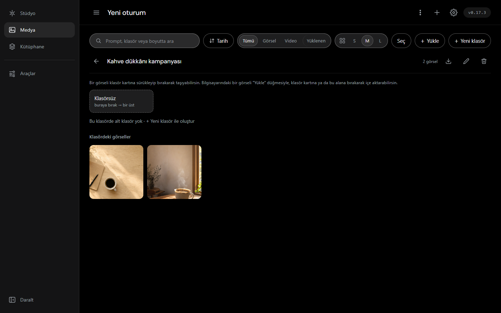

# Kromis Studio — özellik dökümü

Bu belge [README](../README.md)'den taşındı: README kısa bir vitrin, ayrıntı
burada. Maddeler **koda bakılarak** işaretleniyor, belgeye bakılarak değil —
bu yüzden bir madde "teslim" göründüğü hâlde ölçüm onu yalanlayabiliyor (bkz.
video bölümündeki ilk/son kare maddesi).

Kurulum ve çalıştırma: [KURULUM.md](../KURULUM.md) · depo haritası:
[docs/graflar](graflar/README.md) · çalışma düzeni: [CLAUDE.md](../CLAUDE.md)
· ileriye dönük stüdyo planı (sahibin notları, 2026-09-18):
[docs/studyo-guncelleme-plani.md](studyo-guncelleme-plani.md)

---

## ✨ Bugün çalışan özellikler

### 🎬 1. Stüdyo Tek Döküm & Prompt Yönetmeni
* **Türkçe Diyalogdan İngilizce Prompt:** Türkçe fikir anlatımını otomatik olarak optimizasyonu yapılmış İngilizce `gpt-image-2` prompt'una ve teknik ayarlara (`size`, `quality`, `n`) çevirir.
* **Çoklu Sohbet Sağlayıcısı:** Yönetmen artık Azure AI Foundry dağıtımının yanında OpenAI (GPT-5.6 Terra / Luna / Sol) ve Google Gemini (3.7 Flash) ile de konuşuyor. Model, composer'ın üstündeki şeritten seçiliyor ve seçim `prefs.json`'a yazılıyor. **Şeritler anahtarına göre süzülüyor:** yalnızca kimliği kayıtlı sağlayıcıların modelleri listeleniyor (hiçbiri kayıtlı değilse ilk kurulum için hepsi görünür). Ayarlar'daki **"Prompt Yönetmeni (sohbet modeli)" bölümü de yalnızca onu isteyen sağlayıcıda** (Azure) görünüyor: dağıtım adı istemeyen bir sağlayıcıda başlık dahil hiçbir şey çıkmıyor, yönetmenin talimat dosyası yolu ise her sağlayıcıda duruyor.
* **Tıklanabilir Çip Menüleri:**
  - `options`: Yönetmenin sorduğu sorular için tıklanabilir yanıt önerileri.
  - `variations`: Fikirden türetilen tek tıkla uygulanabilir varyasyonlar.
  - `parameters`: Stil, ışık, açı ve kompozisyon parametre eksenleri.
* **Oturum Yönetimi & Kebap Menüsü:** Sohbet geçmişleri diske saklanır (`output/chats.json`), kenar panelinde listelenir. Üst şeritteki kebap menüsü (`#chats-kebab`) ile oturumlar yeniden adlandırılabilir, temizlenebilir veya toplu olarak silinebilir.

### 🖼️ 2. Görsel Üretimi & Çoklu Referans Düzenleme
* **Çoklu Sağlayıcı Entegrasyonu:** Azure OpenAI (`gpt-image-2`), OpenAI (`gpt-image-2`) ve Google Gemini (Nano Banana 2 / Nano Banana Pro) üretimi (1-4 görsel). Gemini'de piksel boyutu yerine oran (1:1 … 21:9) ve 1K/2K/4K çözünürlük seçiliyor. *DALL-E 3 12 Mayıs 2026'da OpenAI API'sinden kalktığı için katalogdan çıkarıldı; `gpt-image-1` de 23 Ekim 2026 emekliliğinden önce, 2026-09-21'de çıkarıldı.*
* **Sağlayıcı İşareti:** Her iki model şeridi (görsel ve Prompt Yönetmeni) seçili modelin sağlayıcısını bir işaretle de gösteriyor — Gemini modelinde Gemini, OpenAI'de OpenAI, Azure'da Azure. Model değişince işaret de değişiyor.
* **Alttan Açılan Model Seçici:** Stüdyo'daki model çipine dokununca alttan bir panel yükseliyor ve her model bir kart olarak listeleniyor: sağlayıcı işareti, adı, **ne işe yaradığını anlatan bir satır** ve kredi aralığı. O tanıtım metni daha önce yalnızca `title` özniteliğindeydi, yani telefonda hiç görünmüyordu. Seçili kart arayüz temasının rengiyle işaretleniyor (Monokrom / Okyanus / Amber / Menekşe) ve seçim dokunduğun an geçerli oluyor. Aynı panel Yönetmen modelinde de kullanılıyor; **Ayarlar** da aynı yüzeye taşındı ve "Kaydet" artık panelin dibinde, kaydırmadan erişilebilir yerde duruyor.
* **Çoklu Referans Görsel Bindirme:** Düzenleme (Inpainting / Edits) modunda ana referans görselin yanına en fazla 3 ek referans görsel eklenebilir.

### 🎞️ 3. Video Üretimi (Metin→Video & Görsel→Video)
* **Composer'ın üçüncü modu:** Görsel · **Video** · Yönetmen. `⌘/Ctrl+J` üçü
  arasında dolaşıyor. Video modu görselin bütün kabuğunu paylaşıyor (aynı
  prompt kutusu, aynı ayar çekmecesi, aynı bekleme göstergesi) — yeni bir
  ekran açılmadı.
* **Gemini · Veo 3.1, üç kademe:** Lite (16 kredi/sn), Fast (30) ve tam kademe
  (80, 1080p açık). Anahtar **görsel tarafıyla paylaşılıyor** — aynı
  `GEMINI_API_KEY`, Ayarlar'a yeni bir alan gelmedi. Ses modelin kendisi
  üretiyor.
* **Yeni eksen: SÜRE.** 4 / 6 / 8 saniye ve kredi tahmini süreyle çarpılıyor,
  çünkü video tarifesi **saniye başına** (görselde üretim başına). Oran yalnız
  16:9 ve 9:16 — Veo'nun belgelediği iki jeton; ötekiler telde 400 demek olurdu.
* **Görseli tek tıkla canlandırma:** Medya'daki bir karonun "Referans"ına
  dokunup Video moduna geçmek yeterli; ilk kare o görsel oluyor ve kayıtta
  türev bağı (`parent_id`) duruyor.
* **Yeni medya türü uçtan uca:** depo `.mp4` yazıyor (uzantı kaydın türünden
  türetiliyor), galeri karosu ve döküm kartı `<video>` çiziyor, büyüteç
  denetimleriyle oynatıyor, indirme doğru adı ve MIME'ı veriyor. Süre rozeti
  bir video karosunu hareketsiz ilk karesinden ayırıyor.
* ⚠️ **Üretim 1-6 dakika sürüyor ve SENKRON:** istek o süre boyunca açık
  kalıyor, yani sekmeyi kapatmak işi kaybettiriyor (iş kuyruğu açık bir madde).
* ⚠️ **Veo'nun ücretsiz kademesi YOK:** ilk saniyeden faturalanıyor. Görsel
  üretiminde çalışan bir Gemini anahtarı, projesinde faturalandırma açık
  değilse burada reddediliyor — ve hata metni bunu açıkça söylüyor, "anahtarını
  kontrol et" demiyor.
* **fal.ai: üç ek video modeli, Veo'nun eksenlerini aşıyor.** Toplayıcı
  (`fal_client.py`), tek `FAL_KEY`, `credential="fal"`. Kendi ön ödemeli
  uyarısı var (aşağıda) — Veo'nun "ücretsiz kademesi yok" uyarısının kardeşi.
  - **Alibaba Wan 3.0** — 480p/720p/1080p, 5 veya 10 sn, oran 16:9·9:16·1:1.
    **Metin→video CANLI DOĞRULANDI** (2026-09-14: 134,9 sn, 2.944.002 bayt).
    **Görsel→video de CANLI DOĞRULANDI** (2026-09-15, Görev 8: 512×512
    referans kareyle uçtan uca 103,05 sn'de tamamlandı, 1.543.287 baytlık MP4,
    `credits=50` ≈ 0,25 USD, `request_id=01a0a586-7de0-7d61-8bae-89cc60ab86c0`) —
    bu depoda görsel→video'nun canlı üretimle tamamlandığı İLK sağlayıcı
    (Veo'nun bitiş-karesi kusuru yüzünden fal öncesi bu yol hiç kanıtlanmamıştı).
    Bitiş karesi desteklemiyor.
  - **PixVerse C1** — 720p/1080p, 5/10/15 sn (Veo'nun 8 sn tavanını aşan iki
    modelden biri), oran 16:9·9:16·1:1. En ucuz fal kademesi. Metin→video
    CANLI DOĞRULANDI (2026-09-14). **Görsel→video tel alan adı yalnız fal'ın
    OpenAPI ŞEMASINDAN ölçüldü** (`image_url`), canlı üretimle sınanmadı —
    bütçe dışı kaldı (~0,33 USD, ayrı bir tur gerekir). Bitiş karesi
    desteklemiyor.
  - **Kling V3 Turbo Pro** — 1080p (tek, gizli jeton — `resolution` alanı iki
    uçta da YOK), 5/10/15 sn, oran yalnız METİN ucunda etkili. En
    pahalı fal kademesi (saniyesi düz 0,14 USD, çözünürlükten bağımsız).
    Metin→video CANLI DOĞRULANDI (2026-09-14). **Görsel→video tel alan adı VE
    `duration`ın dize (`"5"`) gitmesi yalnız ŞEMADAN ölçüldü**, canlı üretimle
    sınanmadı — bütçe dışı kaldı (~0,70 USD). Bitiş karesi desteklemiyor.
  - **Kredi tarifesi** (1 kredi ≈ 0,005 USD, Azure'ın `medium` çapasından):
    Wan 480p/720p/1080p → 10/20/40 kredi/sn; PixVerse 720p/1080p → 13/24
    kredi/sn; Kling düz 28 kredi/sn (çözünürlükten bağımsız).
  - ⚠️ **Bilinen sınır — ölçüldü (2026-09-15, Görev 8).** fal, referans kare
    (Wan'da `start_image_url`) için görselin **en az 240×240 piksel**
    olmasını istiyor; altında kalan bir görsel fal'ın kendi İngilizce `422`
    mesajıyla ("Image dimensions are too small. Minimum dimensions are
    240x240 pixels.") reddediliyor. `app.py` yüklenen görsel için yalnız
    DOSYA BOYUTU ve MIME'ı sınıyor, bir ALT piksel-boyutu denetimi yok —
    Veo yolunda da aynı açık var, arayüz bu sınırı önceden göstermiyor.
    Kod bu turda değiştirilmedi (kapsam tüm sağlayıcıları etkiler, ayrı iş).
  - ⚠️ **Bilinen sağlayıcı sınırı — ölçüldü (2026-09-15, Görev 8).** PixVerse
    ve Kling'in görsel→video uçlarında `aspect_ratio` alanı şemada HİÇ YOK —
    oranı ilk kareden türetiyorlar. Ama composer'ın oran seçici arayüzü
    canlandırma yönünde de bu iki model için oran sunuyor: seçilen oran bu
    iki modelde TEL ÜZERİNDE ETKİSİZ (istek kabul edilir, video ilk karenin
    oranında döner, hiçbir hata görünmez). Wan'da böyle değil — Wan'ın i2v
    ucu `aspect_ratio`'yu gerçekten kabul ediyor. Arayüzü yöne göre kısmak
    ayrı bir iş; bu turda dokunulmadı.

### 📁 4. Klasörler & Medya Yönetimi

* **Sınırsız Hiyerarşik Klasör Ağacı:** İç içe alt klasörler (`parent_id` hiyerarşisi), kırıntı (breadcrumb) gezintisi.
* **Klasör kapakları (`.folder-thumb`) — ÖLÇÜLDÜ, KÖKTE ÇALIŞMIYOR.** Kod niyeti
  şu: klasör kartı, o klasördeki ilk görselin küçük resmini kapak yapar
  (`folders.js` → `createFolderCell`). Ama kapak `historyCache` içinde
  `folder_id === f.id` olan bir kayıt arıyor ve kök görünümde `GET /api/history`
  YALNIZ köke ait kayıtları döndürüyor (2026-09-11'de ölçüldü: iki dolu klasör,
  kökte dönen kayıt sayısı 2 ve ikisi de klasörsüz). Yani kartlar kökte her zaman
  varsayılan klasör ikonuna düşüyor. Kapağın çalışması için ya uç klasör
  kayıtlarını da döndürmeli ya da kapak bilgisi `GET /api/folders` yanıtına
  girmeli.
* **Klasör Yeniden Adlandırma:** `#folder-rename` düğmesi ile klasör adları anında güncellenir.
* **Sürükle-Bırak Taşıma:** Görseller klasör kartlarına sürüklenerek kolayca taşınabilir. Bilgisayardan dosya bırakılarak doğrudan içe aktarılabilir.
* **Medya Sıralama & Arama:** Görseller ve klasörler **Tarih** veya **İsim (A-Z)** sırasına göre dizilebilir. Prompt, boyut veya klasör adına göre anlık arama yapılabilir.
* **Boş Durum Glifleri:** Boş galeri veya arama sonuçlarında açıklayıcı Türkçe boş durum ekranları beliriyor.

### 🔘 5. Çoklu Seçim & Toplu İşlemler
* **Toplu Seçim Modu:** Görseller tek tıkla seçilebilir, seçili gruptaki görseller tek seferde başka bir klasöre sürüklenebilir veya toplu olarak silinebilir.

### 🎨 6. OKLCH Renk Teorisi & Palet Motoru
* **OKLCH Armoni Önerileri:** Bir tohum renkten 6 uyumlu renk paleti türetilir.
* **3 Kademeli Renk Baskısı:** İpucu (%25), Dengeli (%50), Katı (%85) renk hassasiyet seviyeleri.
* **Paletten Renk Çıkarma:** İstenmeyen renkler çipe tıklanarak paletten çıkarılabilir.
* **Damlalık (EyeDropper):** Tarayıcıda EyeDropper API, macOS masaüstü uygulamasında yerel `NSColorSampler` ile ekranın her yerinden renk seçimi.

### 🏷️ 7. Varlık Kütüphanesi & Bindirme (Logo / Motto / Banner)
* **Kurumsal Bindirme:** Görsel üzerine Logo, Motto veya Banner yerleştirme.
* **9'lu Izgara Çapası & Offset Kaydırma:** 9 farklı yön noktasına çapalama ve hassas oran kaydırma, boyut ve gölge ayarları. Canlı önizleme desteği.

### 🌙 8. Tüm Uygulamayı Kapsayan Tema Motoru
* **4 Curated Dark Theme:** **Mono** (Siyah/Gri), **Ocean** (Okyanus Mavisi), **Amber** (Kehribar/Sıcak), **Viola** (Mor/Asil) karanlık cam Temaları.
* **Erişilebilirlik:** `prefers-reduced-motion` desteği.

### 🔒 9. BYOK (Bring Your Own Key) & Güvenlik Redaksiyonu
* **Çoklu Sağlayıcı Desteği:** OpenAI, Fal.ai, Replicate, ComfyUI, Ollama altyapısı.
* **Write-Only Güvenlik Maskelemesi:** `GET /api/settings` yanıtlarında hiçbir API anahtarı istemciye açık olarak dönmez, yalnızca boolean durum bayrakları döndürülür.
* **Otomatik Log Sansürleme:** `errlog.py` içerisindeki `redact_secrets()` mekanizması, loglarda veya hata traceback'lerinde geçen tüm API anahtarlarını sansürler.

---

## 🔮 Yol haritası (SaaS dönüşüm planı)

> **Durum denetimi (2026-08-22).** 21–22 Ağustos'taki çoklu sağlayıcı turundan
> (model kataloğu → sağlayıcı adaptörleri → Gemini) sonra her madde **koda
> bakılarak** işaretlendi, belgeye bakılarak değil. Faz faz tam döküm ve kanıtlar:
> [master yol haritası](superpowers/specs/2026-08-10-saas-transformation-master-design.md).
> **Sıradaki iş ve öncelik sıralı kuyruk:**
> [görev defteri](superpowers/plans/2026-08-22-gorev-defteri.md) — hangi
> maddenin neden beklediği, kabul ölçütüyle birlikte orada yazılı.

* **Faz 2: BYOK Çoklu Sağlayıcı Arayüzü** — 🟡 kısmen teslim
  - [x] **Model ve sağlayıcı seçimi:** üst şeritte görsel modeli seçici, composer'da
        sohbet modeli şeridi; ikisi de kayıtlı anahtara göre süzülüyor ve seçim
        `prefs.json`'a yazılıyor.
  - [x] **Ayarlar panelinde sağlayıcı grupları:** Azure OpenAI, OpenAI ve Google Gemini
        (yalnız-OpenAI ya da yalnız-Gemini kurulumu da geçerli).
  - [x] **Sağlayıcı adaptör katmanı:** görselde `providers.py`, sohbette
        `chat_providers.py`; kataloğa girmemiş bir sağlayıcı sessizce Azure'a düşmüyor.
  - [ ] Fal.ai, Replicate, ComfyUI ve Ollama sekmeleri — bugün yalnızca
        `credentials.env` alanları ve durum bayrakları var; adaptör ve arayüz yok.
  - [ ] Canlı bağlantı testi düğmeleri — bugünkü karşılık yalnız "anahtar kayıtlı mı"
        listesi, gerçek bir çağrı denemesi değil.
* **Faz 3: E-Ticaret Ürün Araçları** — ⬜ açık
  - [ ] Elde Ürün Görselleştirme (Product-in-Hand).
  - [ ] Otomatik Arka Plan Kaldırma & Konu Gölgeleme.
  - [ ] Görsel İçi Metin & Banner Sihirbazı (E-ticaret duyuruları için).
* **Faz 4: Image-to-Video Animasyon Motoru** — 🟡 kısmi (Veo teslim)
  - [x] **Video modu:** composer'ın üçüncü modu (Görsel · Video · Yönetmen). Metinden
        video ve galerideki bir görseli tek tıkla animasyona çevirme
        (`POST /api/video`, `POST /api/video/animate`).
  - [x] **Gemini · Veo 3.1** üç kademesiyle katalogda (Lite · Fast · tam).
        Anahtar GÖRSEL tarafıyla paylaşılıyor — Ayarlar'a yeni bir alan gelmedi.
        Yeni eksen SÜRE (4/6/8 sn) ve kredi tarifesi saniye başına.
  - [x] **Yeni medya türü uçtan uca:** depo `.mp4` yazıyor (uzantı kaydın `kind`inden
        türetiliyor), galeri karosu ve döküm kartı `<video>` çiziyor, büyüteç
        oynatıyor, indirme doğru adı ve MIME'ı veriyor.
  - [x] **fal.ai video toplayıcısı teslim edildi:** Alibaba Wan 3.0, PixVerse
        C1, Kling V3 Turbo Pro — tek `FAL_KEY`, kuyruk adaptörü
        `fal_client.py` (`providers._VIDEO_ADAPTERS`). Wan metin→video VE
        görsel→video ikisi de CANLI doğrulandı (2026-09-14 / 2026-09-15);
        PixVerse ve Kling'in tel alan adları yalnız OpenAPI şemasından
        ölçüldü, canlı üretimle sınanmadı (bütçe dışı kaldı). Luma, Runway ve
        Replicate (`REPLICATE_API_TOKEN` alanı duruyor, adaptör yok) hâlâ AÇIK.
  - [ ] İş kuyruğu: üretim bugün SENKRON, yani sekme yenilenirse iş kaybediliyor.
  - [ ] **İlk/son kare geçişi — ÖLÇÜLDÜ, ÇALIŞMIYOR.** `instances[0].lastFrame`
        alanı, katalogdaki `supports_last_frame` bayrağı ve ayar sayfasındaki iki
        kare yuvası duruyor. Madde `[x]` işaretliydi, yanındaki not ise "alan adı
        CANLI DOĞRULANMADI" diyordu — 2026-09-11'de doğrulandı ve SONUÇ OLUMSUZ:
        bitiş görseli seçilip istek gönderildiğinde Veo
        **HTTP 400 — "your use case is currently not supported"** döndürüyor.
        Yani yalnız alan adı değil, kullanım biçiminin kendisi desteklenmiyor.
        Ölçüm yalnız İKİ kareli isteği kapsıyor; tek başına başlangıç görseliyle
        canlandırma bu turda denenmedi, onun için ayrı bir ölçüm gerekiyor.
  - [ ] `extend-video` ve çoklu referans (`referenceImages`) — Veo destekliyor,
        katalogda yetenek bayrağı yok.
  - **Ölü uçlar (araştırıldı, girmedi):** OpenAI Sora 2 / Videos API 24 Eylül
    2026'da kapanıyor ve yerine gelen bir ad yok; Azure AI Foundry'de video
    barındırılmıyor; Anthropic'in video ucu yok.
* **Faz 5: SaaS & Bulut Altyapısı** — 🟡 yalnız kredi metadata'sı hazır
  - [x] **Model bazlı kredi tarifesi:** katalogda her modelin kredisi yazılı ve üretim
        anındaki değer kayda geçiyor. **Bugün YALNIZ metadata:** hiçbir bakiye
        düşülmüyor, hiçbir üretim engellenmiyor — gelecek ledger'ın ihtiyacı olan alan
        şimdiden dolu.
  - [ ] Kullanıcı hesapları ve çoklu çalışma alanları (Workspaces).
  - [ ] Nesne depolama + CDN (Cloudflare R2 / MinIO) ve medya yönetimi.
  - [ ] Üyelik paketleri (Free, Basic, Pro, Max) ve atomik kredi ledger'ı.
  - [ ] Ücretsiz pakette filigran (watermark) kuralı.
