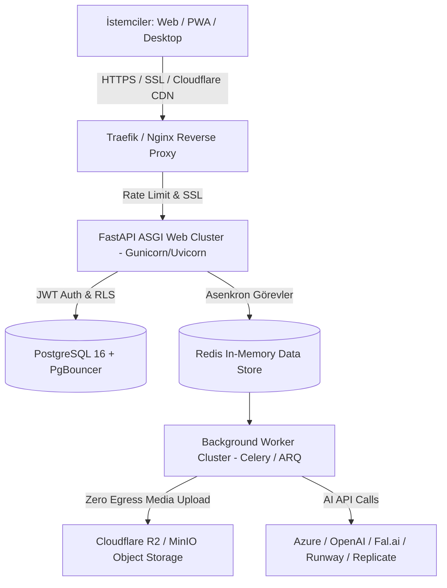

# GPT-Image Studio: Açık Kaynak (BYOK + Local Models), Yüksek Güvenlikli Çoklu Platform & SaaS Platformu — Master Tasarım Dokümanı

**Tarih:** 2026-08-10  
**Hedef Sürüm:** v0.2.0  
**Durum:** Taslak / Yol Haritası (Master Spec)  
**Vizyon:** GPT-Image Studio'yu hem GitHub üzerinde açık kaynak (BYOK ve yerel ComfyUI/Ollama entegrasyonlu) olarak yerelde çalıştırılabilen, macOS ve Windows için otomatik paketlenen, hem de yeni ve bağımsız bir sunucuda yüksek ölçekli ve kredi tabanlı bir SaaS yapay zeka stüdyosuna dönüştürmek.

---

## 1. Bağımsız Sunucu, PaaS & Medya Depolama Alternatifleri (Faz 5 Infrastructure Matrix)

Uygulamanın mevcut sunuculardan bağımsız, sadece bu projeye özel yeni bir sunucuda yayınlanması için PaaS, Sunucu ve Medya depolama alternatifleri değerlendirmesi:

### 🖥️ 1.1 Sunucu Sağlayıcı (VPS / Dedicated Server) Alternatifleri
| Sağlayıcı | Avantajları | Dezavantajları | Öneri Notu |
|---|---|---|---|
| **Hetzner (Almanya/Finlandiya)** | **En yüksek Fiyat/Performans**, sınırsız/yüksek bant genişliği, güçlü CPU & RAM (CX42 / Dedicated AX serisi). | Sadece Avrupa lokasyonu. | **🥇 (EN ÖNERİLEN)** SaaS üretimi için maliyet/performans lideri. |
| **DigitalOcean / Linode** | Kolay yönetim, yüksek güvenilirlik, hazır S3 Spaces nesne depolaması. | Hetzner'e göre bant genişliği ve donanım maliyeti daha yüksek. | Standart bulut geliştirici seçeneği. |
| **Contabo** | Çok ucuz RAM ve Disk kapasitesi. | Yüksek eşzamanlı disk I/O yüklerinde performans dalgalanması yaşanabilir. | Bütçe dostu test/başlangıç sunucusu. |

### 🚀 1.2 PaaS / Dağıtım Aracı (Deployment Tool) Alternatifleri
| Araç | Avantajları | Dezavantajları | Öneri Notu |
|---|---|---|---|
| **Coolify** | **Self-hosted Heroku/Netlify**, Docker Compose, PostgreSQL, Redis, Otomatik SSL, harika web paneli. | Sunucu kaynağında hafif bir yönetim yükü (~200MB RAM). | **🥇 (EN ÖNERİLEN)** Git push ile dağıtım kolaylığı. |
| **Dokku** | Çok hafif, Git push yeteneği olan klasik Docker PaaS. | Web arayüzü yok, CLI üzerinden yönetilir. | CLI odaklı hafif alternatif. |
| **CapRover** | Docker Swarm tabanlı tek tıkla uygulama ve SSL yönetimi. | Coolify kadar aktif güncellenmiyor. | Web panelli alternatif. |
| **Saf Docker Compose + Traefik** | Sıfır PaaS yükü, tam kontrol ve hafiflik. | Manuel SSL ve CI/CD yapılandırması gerektirir. | Maksimum performans isteyen minimalist yaklaşım. |

### 📦 1.3 Medya & Nesne Depolama (Object Storage & CDN) Alternatifleri
| Depolama | Avantajları | Maliyet Modeli | Öneri Notu |
|---|---|---|---|
| **Cloudflare R2** | **SIFIR Trafik (Egress) Ücreti!** S3 API uyumlu, küresel CDN entegrasyonu. | $0.015 / GB depolama (Trafik tamamen ücretsiz). | **🥇 (EN ÖNERİLEN)** Binlerce kullanıcının ürettiği medyaları sunarken sürpriz fatura çıkarmaz. |
| **MinIO (Self-Hosted S3)** | Sunucu diskinde çalışan %100 açık kaynak S3 depolama. | $0 (Sunucu diski maliyetine dahil). | Dış servis bağımlılığı istemeyenler için ideal. |
| **Cloudinary** | Otomatik görsel optimizasyonu ve genişletilmiş dönüşümler. | Kredi/bant genişliği dolduğunda yüksek maliyet. | İlk aşama / prototip için uygun, ölçekte R2 daha ekonomiktir. |

---

## 2. Yüksek Ölçekli Sunucu Mimarisi (Production Architecture)

---

## 3. Güvenlik ve Koruma Mimarisi (Security Architecture)

- **API Key & Secrets Protection:** `gitleaks` taraması, write-only API anahtarları, redaction exception handler.
- **Dosya Sistemi & Input Safety:** Path traversal süzgeci (`_SAFE_ID`), Pillow ile EXIF/polyglot temizleme, DoS çözünürlük sınırı.
- **SaaS İzolasyonu:** PostgreSQL Row-Level Security (RLS), JWT Auth, Atomik kredi ledger.

---

## 4. Dağıtım & Paketleme Stratejisi

1. **Açık Kaynak & Yerel Masaüstü Modu (Free / BYOK):** GitHub Releases (`macOS arm64`, `macOS x86_64`, `Windows x64`).
2. **Bağımsız Sunucuda SaaS Modu (Hetzner + Coolify/Docker + Cloudflare R2):** İzolasyonlu prodüksiyon yayını.
3. **Mobil Uygulama Modu (Gelecek Faz):** Responsive PWA ve iOS/Android mobil uygulaması.

---

## 5. Aşamalı Yol Haritası (Master Roadmap)

### 📍 Hazırlık Fazı: Açık Kaynak, Sürüm (v0.2.0), BYOK, Güvenlik & CI/CD
- Sürüm `v0.2.0`, BYOK anahtar güvenliği, `gitleaks` taraması, `.github/workflows/release.yml` (Windows + macOS otomasyonu), MIT Lisansı.

### 📍 Faz 1: Tuval, Maskeleme & Bölgesel AI Düzenleme (Inpainting)
- Fırça/silgi maske çizim alanı (HTML5 Canvas), güvenli `/api/edit` inpainting entegrasyonu.

### 📍 Faz 2: Stil Şablonları, Tipografi Katmanı, Stil Çipleri & Prompt Yönetmeni
- Stil kartları, tipografi katmanı, hızlı stil çipleri (*Anime*, *Cyberpunk*, *Cinematic*, *Pixel Art*, *3D Render*) ve model-aware Prompt Yönetmeni.

### 📍 Faz 3: Çoklu Görsel & Video Modelleri Engine (Cloud + Local Provider Adapter)
- **Çoklu Görsel Engine:** Cloud + Local provider adaptörleri, Model Arena.
- **AI Video & Hareketlendirme (Image-to-Video):** Wan 2.7, Runway, Luma, Veo 3.1 entegrasyonları.
- **Özel AI Araçları:** `AI Image Upscaler` (4K/8K süper çözünürlük) ve `Product Showcase / Product-in-Hand` (E-ticaret ürün/el konsepti).

### 📍 Faz 4: Çoklu Dil Desteği (i18n Framework)
- TR/EN dil altyapısı.

### 📍 Faz 5: Bağımsız Sunucuda SaaS Dönüşümü (Hetzner VPS, Coolify, PostgreSQL RLS, Redis & Cloudflare R2)
- Yeni bağımsız sunucu kurulumu, Coolify PaaS, PostgreSQL (RLS), Redis + Worker Kuyruğu, Cloudflare R2 (Sıfır Egress Depolama), JWT Auth.
- **Model Bazlı Dinamik Kredi Tarifesi:**
  - Standart Görsel (ImageFx Pro, DALL-E 3): 4–10 Kredi
  - Yüksek Çözünürlüklü / Premium Görsel (Nano Banana 2, Flux Pro): 20 Kredi
  - AI Video Üretimi (Wan 2.7, Veo 3.1): 50–105 Kredi
- **Filigran & Kredi Kuralları:** Ücretsiz deneme katmanı (filigranlı), Ücretli katmanlar (filigransız + ticari haklar), Devredilmeyen devirli aylık kredi mantığı (no-rollover).
- **Ödeme Altyapısı:** Stripe / PaynKolay entegrasyonu.

### 📱 Faz 6 (Gelecek Faz): Mobil Uygulama (PWA & Mobile Native App)
- PWA ve iOS/Android mobil uygulaması.
