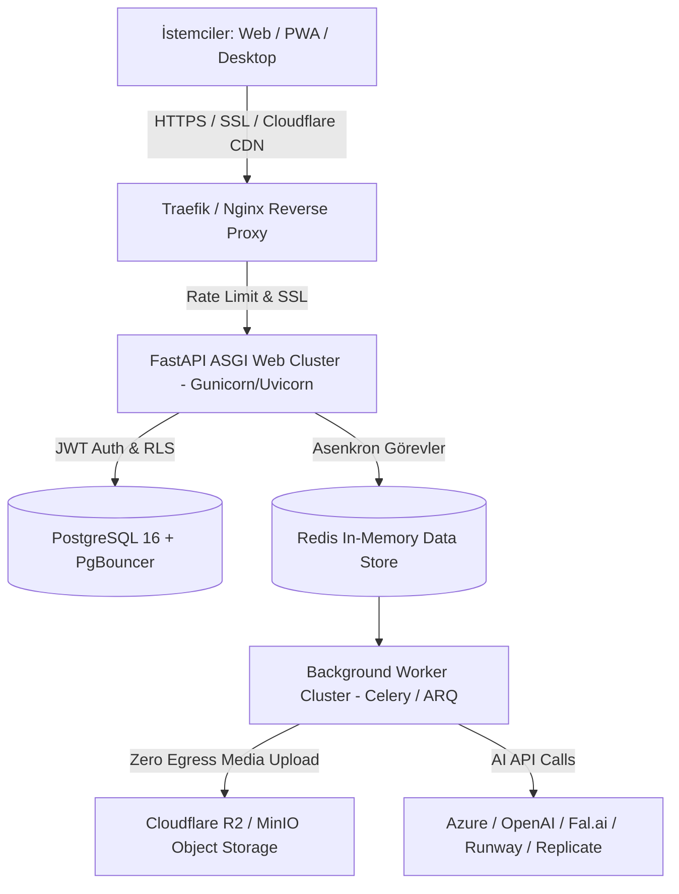

# GPT-Image Studio: Açık Kaynak (BYOK + Local Models), Yüksek Güvenlikli Çoklu Platform & SaaS Platformu — Master Tasarım Dokümanı

**Tarih:** 2026-08-10  
**Hedef Sürüm:** v0.2.0  
**Durum:** Yol Haritası (Master Spec) — **son durum denetimi: 2026-08-22** (bkz. §5)  
**Vizyon:** GPT-Image Studio'yu hem GitHub üzerinde açık kaynak (BYOK ve yerel ComfyUI/Ollama entegrasyonlu) olarak yerelde çalıştırılabilen, macOS ve Windows için otomatik paketlenen, hem de yeni ve bağımsız bir sunucuda yüksek ölçekli ve kredi tabanlı bir SaaS yapay zeka stüdyosuna dönüştürmek.

---

## 1. Bağımsız Sunucu, PaaS & Medya Depolama Alternatifleri (Faz 5 Infrastructure Matrix)

Uygulamanın mevcut sunuculardan bağımsız, sadece bu projeye özel yeni bir sunucuda yayınlanması için PaaS, Sunucu ve Medya depolama alternatifleri değerlendirmesi:

### 🖥️ 1.1 Sunucu Sağlayıcı (VPS / Dedicated Server) Alternatifleri
| Sağlayıcı | Avantajları | Dezavantajları | Öneri Notu |
|---|---|---|---|
| **Hetzner (Almanya/Finlandiya)** | **En yüksek Fiyat/Performans**, sınırsız/yüksek bant genişliği, güçlü CPU & RAM (CX42 / Dedicated AX serisi). | Sadece Avrupa lokasyonu. | **🥇 (EN ÖNERİLEN)** SaaS üretimi için maliyet/performans lideri. |
| **DigitalOcean / Linode** | Kolay yönetim, yüksek güvenilirlik, hazır S3 Spaces nesne depolaması. | Hetzner'e göre bant genişliği ve donanım maliyeti daha yüksek. | Standart bulut geliştirici seçeneği. |
| **Contabo** | Çok ucuz RAM ve Disk kapasitesi. | Yüksek eşzamanlı disk I/O yüklerinde performans dalgalanması yaşanabilir. | Bütçe dostu test/başlangıç sunucusu. |

### 🚀 1.2 PaaS / Dağıtım Aracı (Deployment Tool) Alternatifleri
| Araç | Avantajları | Dezavantajları | Öneri Notu |
|---|---|---|---|
| **Coolify** | **Self-hosted Heroku/Netlify**, Docker Compose, PostgreSQL, Redis, Otomatik SSL, harika web paneli. | Sunucu kaynağında hafif bir yönetim yükü (~200MB RAM). | **🥇 (EN ÖNERİLEN)** Git push ile dağıtım kolaylığı. |
| **Dokku** | Çok hafif, Git push yeteneği olan klasik Docker PaaS. | Web arayüzü yok, CLI üzerinden yönetilir. | CLI odaklı hafif alternatif. |
| **CapRover** | Docker Swarm tabanlı tek tıkla uygulama ve SSL yönetimi. | Coolify kadar aktif güncellenmiyor. | Web panelli alternatif. |
| **Saf Docker Compose + Traefik** | Sıfır PaaS yükü, tam kontrol ve hafiflik. | Manuel SSL ve CI/CD yapılandırması gerektirir. | Maksimum performans isteyen minimalist yaklaşım. |

### 📦 1.3 Medya & Nesne Depolama (Object Storage & CDN) Alternatifleri
| Depolama | Avantajları | Maliyet Modeli | Öneri Notu |
|---|---|---|---|
| **Cloudflare R2** | **SIFIR Trafik (Egress) Ücreti!** S3 API uyumlu, küresel CDN entegrasyonu. | $0.015 / GB depolama (Trafik tamamen ücretsiz). | **🥇 (EN ÖNERİLEN)** Binlerce kullanıcının ürettiği medyaları sunarken sürpriz fatura çıkarmaz. |
| **MinIO (Self-Hosted S3)** | Sunucu diskinde çalışan %100 açık kaynak S3 depolama. | $0 (Sunucu diski maliyetine dahil). | Dış servis bağımlılığı istemeyenler için ideal. |
| **Cloudinary** | Otomatik görsel optimizasyonu ve genişletilmiş dönüşümler. | Kredi/bant genişliği dolduğunda yüksek maliyet. | İlk aşama / prototip için uygun, ölçekte R2 daha ekonomiktir. |

---

## 2. Yüksek Ölçekli Sunucu Mimarisi (Production Architecture)

---

## 3. Güvenlik ve Koruma Mimarisi (Security Architecture)

- **API Key & Secrets Protection:** `gitleaks` taraması, write-only API anahtarları, redaction exception handler.
- **Dosya Sistemi & Input Safety:** Path traversal süzgeci (`_SAFE_ID`), Pillow ile EXIF/polyglot temizleme, DoS çözünürlük sınırı.
- **SaaS İzolasyonu:** PostgreSQL Row-Level Security (RLS), JWT Auth, Atomik kredi ledger.

---

## 4. Dağıtım & Paketleme Stratejisi

1. **Açık Kaynak & Yerel Masaüstü Modu (Free / BYOK):** GitHub Releases (`macOS arm64`, `macOS x86_64`, `Windows x64`).
2. **Bağımsız Sunucuda SaaS Modu (Hetzner + Coolify/Docker + Cloudflare R2):** İzolasyonlu prodüksiyon yayını.
3. **Mobil Uygulama Modu (Gelecek Faz):** Responsive PWA ve iOS/Android mobil uygulaması.

---

## 5. Aşamalı Yol Haritası (Master Roadmap)

> **Durum denetimi — 2026-08-22.** Aşağıdaki her faz, 21–22 Ağustos'taki çoklu
> sağlayıcı turundan (v0.5.3 → v0.7.0) sonra **depodaki koda bakılarak**
> işaretlendi; hiçbir madde başka bir belgenin iddiasına dayanarak
> kapatılmadı. Ölçüm anında suite yeşil: `pytest tests/ -q` → **1597 geçti,
> 10 atlandı** (atlananlar yalnız Windows DACL testleri + kurulu olmayan
> Playwright).
>
> **Bu belge NE yapılacağını söylüyor; SIRAYI ve kanıtı görev defteri taşıyor:**
> [`docs/superpowers/plans/2026-08-22-gorev-defteri.md`](../plans/2026-08-22-gorev-defteri.md).
> Aşağıdaki her açık madde orada bir kuyruk satırı olarak, kabul ölçütüyle
> birlikte duruyor.
>
> | Faz | Durum |
> |---|---|
> | Hazırlık (açık kaynak, BYOK, güvenlik, CI/CD) | ✅ teslim |
> | Faz 1 — Tuval, maskeleme, inpainting | 🟡 kısmi (düzenleme var, maske tuvali yok) |
> | Faz 2 — Stil şablonları & Prompt Yönetmeni | 🟡 kısmi (Yönetmen teslim, stil katmanı yok) |
> | Faz 3 — Çoklu görsel & video engine | 🟡 kısmi (bulut adaptörleri teslim, video yok) |
> | Faz 4 — Çoklu dil (i18n) | ⬜ açık |
> | Faz 5 — SaaS dönüşümü | 🟡 yalnız kredi metadata'sı |
> | Faz 6 — Mobil | 🟡 Android teslim, iOS/PWA açık |

### ✅ Hazırlık Fazı: Açık Kaynak, Sürüm (v0.2.0), BYOK, Güvenlik & CI/CD
- Sürüm `v0.2.0`, BYOK anahtar güvenliği, `gitleaks` taraması, `.github/workflows/release.yml` (Windows + macOS otomasyonu), MIT Lisansı.
- **Teslim edildi.** `LICENSE` (MIT) kökte; sürüm hattı v0.2.0'ı çoktan geçti (bugün
  **v0.7.0**) ve `version.py` tek kaynak. Yayın otomasyonu plandan **geniş** çıktı:
  `release.yml` + `_paket-macos.yml` / `_paket-windows.yml` / `_paket-android.yml` —
  üç platform birden yeşil olmadan ne etiket ne yayın oluşuyor.
- Güvenlik payı da yerinde: `GET /api/settings` hiçbir anahtarı (maskeli hâlini bile)
  döndürmüyor, `errlog.redact_secrets` log ve traceback'leri sansürlüyor, doğrulama
  hatalarında gizli alan yankılanmıyor (`app._is_secret_loc`), kimlik dosyası `0600` /
  dizini `0700` — Windows'ta ayrıca DACL ile (`winsec.py`, plandan fazlası).
- **Tek açık kalan:** `gitleaks` taramasının kaydı yok — CI'da böyle bir iş
  tanımlı değil, tarama elle yapıldıysa da kanıtı depoda durmuyor.

### 🟡 Faz 1: Tuval, Maskeleme & Bölgesel AI Düzenleme (Inpainting)
- Fırça/silgi maske çizim alanı (HTML5 Canvas), güvenli `/api/edit` inpainting entegrasyonu.
- **Teslim edilen:** `/api/edit` yolu ve çoklu referans düzenleme (ana referans + en
  fazla 3 ek görsel), sağlayıcı adaptörleri üzerinden.
- **Açık:** maske YOK — ne fırça/silgi tuvali, ne `mask` alanı taşıyan bir istek.
  Bugünkü düzenleme tüm görsel üzerinden çalışıyor, bölgesel değil.

### 🟡 Faz 2: Stil Şablonları, Tipografi Katmanı, Stil Çipleri & Prompt Yönetmeni
- Stil kartları, tipografi katmanı, hızlı stil çipleri (*Anime*, *Cyberpunk*, *Cinematic*, *Pixel Art*, *3D Render*) ve model-aware Prompt Yönetmeni.
- **Teslim edilen: Prompt Yönetmeni ve model duyarlılığı.** Türkçe diyalogdan İngilizce
  prompt + teknik ayar; `options` / `variations` / `parameters` çip menüleri; oturumlar
  diskte. **21 Ağustos'ta model seçimi de geldi:** Yönetmen Azure dağıtımının yanında
  OpenAI (GPT-5.6 Terra/Luna/Sol) ve Gemini 3.7 Flash ile de konuşuyor, şerit kayıtlı
  anahtara göre süzülüyor.
- **Açık:** stil kartları/şablonları, tipografi katmanı ve hazır stil çipleri
  (*Anime*, *Cyberpunk*, …) — hiçbiri kodda yok. (Bindirmedeki motto/banner metni bunun
  yerine geçmiyor: o kurumsal bindirme, prompt stili değil.)

### 🟡 Faz 3: Çoklu Görsel & Video Modelleri Engine (Cloud + Local Provider Adapter)
- **Çoklu Görsel Engine:** Cloud + Local provider adaptörleri, Model Arena.
- **AI Video & Hareketlendirme (Image-to-Video):** Wan 2.7, Runway, Luma, Veo 3.1 entegrasyonları.
- **Özel AI Araçları:** `AI Image Upscaler` (4K/8K süper çözünürlük) ve `Product Showcase / Product-in-Hand` (E-ticaret ürün/el konsepti).
- **Teslim edilen: bulut adaptör katmanı** (21–22 Ağustos turunun ana işi). `catalog.py`
  model/kimlik/kredi kaydı; `providers.py` görsel, `chat_providers.py` sohbet sevkiyatı;
  yetenek doğrulaması ve yeteneğe göre süzülen arayüz kontrolleri. Bugün **5 görsel
  modeli** (Azure gpt-image-2; OpenAI gpt-image-2 / gpt-image-1; Gemini Nano Banana 2 /
  Nano Banana Pro) ve **5 sohbet modeli** kayıtlı. *DALL·E 3, 12 Mayıs 2026'da API'den
  kalktığı için katalogdan çıkarıldı.*
- **Açık:** yerel sağlayıcı adaptörleri (ComfyUI, Ollama) — `credentials.env` alanları
  duruyor, adaptör yok; **Model Arena** (aynı prompt'u yan yana koşturma); **video**
  tarafının tamamı; **upscaler**; **Product Showcase / Product-in-Hand**.

### ⬜ Faz 4: Çoklu Dil Desteği (i18n Framework)
- TR/EN dil altyapısı.
- **Açık.** Arayüz metinleri HTML/JS içinde birebir Türkçe; sözlük katmanı, dil
  anahtarı ya da `locale` kavramı yok.

### 🟡 Faz 5: Bağımsız Sunucuda SaaS Dönüşümü (Hetzner VPS, Coolify, PostgreSQL RLS, Redis & Cloudflare R2)
- Yeni bağımsız sunucu kurulumu, Coolify PaaS, PostgreSQL (RLS), Redis + Worker Kuyruğu, Cloudflare R2 (Sıfır Egress Depolama), JWT Auth.
- **Model Bazlı Dinamik Kredi Tarifesi:**
  - Standart Görsel (ImageFx Pro, DALL-E 3): 4–10 Kredi
  - Yüksek Çözünürlüklü / Premium Görsel (Nano Banana 2, Flux Pro): 20 Kredi
  - AI Video Üretimi (Wan 2.7, Veo 3.1): 50–105 Kredi
- **Filigran & Kredi Kuralları:** Ücretsiz deneme katmanı (filigranlı), Ücretli katmanlar (filigransız + ticari haklar), Devredilmeyen devirli aylık kredi mantığı (no-rollover).
- **Ödeme Altyapısı:** Stripe / PaynKolay entegrasyonu.
- **Teslim edilen: kredi tarifesinin kendisi.** Her katalog girdisi kendi kredisini
  taşıyor ve üretim anındaki çözülmüş değer kayda yazılıyor (tarife sonradan değişince
  geçmiş yeniden yazılmasın diye). Çapa ölçülü: Azure `medium` = 8 kredi ≈ 0,04 USD,
  ötekiler kendi yayınlanmış fiyatından türetildi. **Bugün YALNIZ metadata:** bakiye
  düşülmüyor, üretim engellenmiyor — gelecek ledger'ın ihtiyacı olan alan şimdiden dolu.
- **Açık:** sunucu/PaaS kurulumu, PostgreSQL + RLS, Redis + worker, R2, JWT Auth,
  üyelik paketleri, filigran kuralı ve ödeme altyapısı — hiçbirinin kodu yok.

### 🟡 Faz 6: Mobil Uygulama (PWA & Mobile Native App)
- PWA ve iOS/Android mobil uygulaması.
- **Teslim edilen: Android.** Chaquopy tabanlı APK (`android/`, `android_main.py`,
  `mobile.css`) yayın hattında derleniyor ve uygulama telefonda tam çalışıyor;
  paketleme mandalı `tests/test_android_packaging.py`.
- **Açık:** PWA (service worker / manifest yok) ve iOS.
